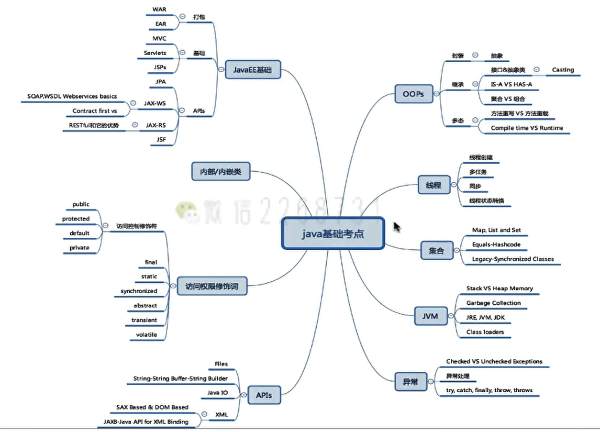
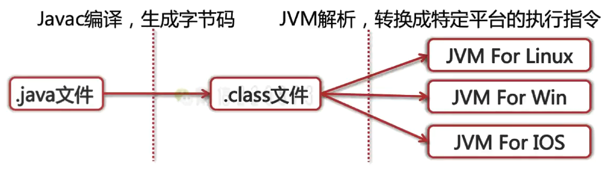
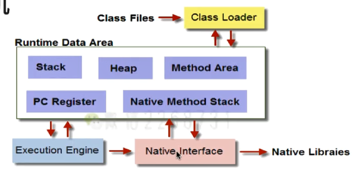

### 谈谈你对Java的理解

◆平台无关性
◆GC
◆语言特性 泛型、lambda

◆面向对象
◆类库
◆异常处理

### Compile Once，Run Anywhere如何实现

javac 编译：语法句法语义的检查。->.class字节码文件

java 运行：

javap -c 对代码进行反汇编



Java源码首先被编译成**字节码**，再由不同平台的JVM进行解析，Java语言在不同的平台上运行时不需要进行重新编译，Java虚拟机在执行字节码的时候，把字节码转换成具体平台上的机器指令。

### JVM如何加载.class文件



◆Class Loader：依据特定格式，加载class文件到内存
◆Execution Engine：对命令进行解析
◆Native Interface：融合不同开发语言的原生库为Java所用
◆Runtime Data Area:JVM内存空间结构模型

### 谈谈反射

JAVA反射机制是在运行状态中，对于任意一个类，都能够知道这个类的所有属性和方法；对于任意一个对象，都能够调用它的任意方法和属性；这种动态获取信息以及动态调用对象方法的功能称为java语言的反射机制。

将类中的属性、方法映射为java对象。解释性的操作。

### 写一个反射的例子

```java
public class Robot{
	private String name; 
    public void sayHi(String helloSentence){
		System. out. println(helloSentence+""+name);
    }
    private String throwHello(String tag){
		return"Hello"+tag;
    }
}
```


```java
public class ReflectSample{
	public static void main(String[] args) throws ClassNotFoundException, IllegalAccessE){
        //获得该类的实例
 		Class rc=Class. forName("com. interview. javabasic. reflect. Robot"); 
        Robot r=(Robot) rc. newInstance(); 
        System. out. println("CLass name is"+rc. getName());
        //该方法可以获得任意的一个方法
        Method getHello=rc. getDeclaredMethod("throwHello", String. class); 
        getHello. setAccessible(true);//若是私有方法，必须设置这个 可访问性
        Object str=getHello.invoke(r,"Bob");//执行私有方法
        System.out.println("getHello result is"+str);
        
        //该方法可以获得公开方法和继承方法
        Method sayHi=rc. getMethod("sayHi", String. class); 
        sayHi. invoke(r,"Welcome");       
        
        //获得类中的任意成员变量
        Field name=rc. getDeclaredField("name"); 
        name. setAccessible(true); 
        name. set(r,"Alice");
    }
}
```


### 类从编译到执行的过程

>编译器将Robot，java源文件编译为Robot.class字节码文件
>ClassLoader将字节码转换为JVM中的Class<Robot>对象
>JVM利用Class<Robot>对象实例化为Robot对象

### 谈谈ClassLoader

ClassLoader在Java中有着非常重要的作用，它主要工作在Class装载的加载阶段，其主要作用是从系统外部获得Class 二进制数据流。它是Java的核心组件，所有的Class都是由ClassLoader进行加载的，ClassLoader 负责通过将 Class文件里的二进制数据流装载进系统，然后交给Java虚拟机进行连接、初始化等操作。

### ClassLoader的种类

>BootStrapClassLoader:C++编写，加载核心库java.*
>ExtClassLoader:Java编写，加载扩展库javax.*
>
>AppClassLoader:Java编写，加载程序所在目录
>
>自定义ClassLoader:Java编写，定制化加载

### 谈谈类加载器的双亲委派机制


