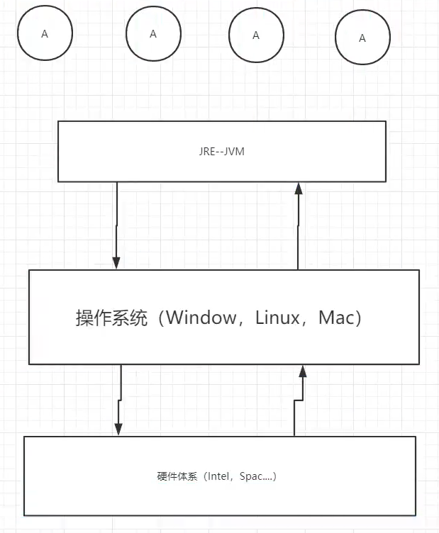
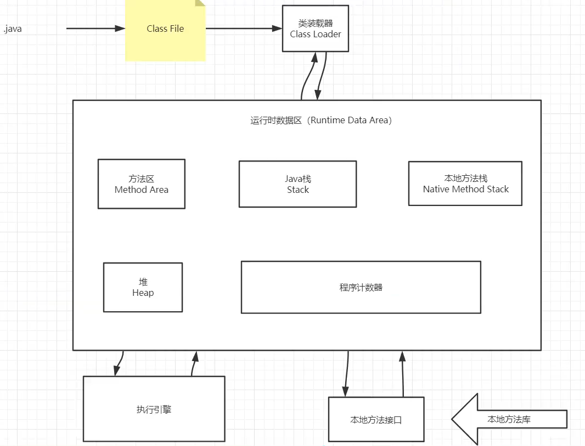

# JVM探究

- 请你谈谈你对VM的理解？jav8虚拟机和之前的变化更新？

- 什么是0OM，什么是栈溢出StackOverFlowError？怎么分析？

- JVM的常用调优参数有哪些？

- 内存快照如何抓取，怎么分析Dump文件？知道吗？

- 谈谈VM中，类加载器你的认识？

  1.JVM的位置

2.JVM的体系结构

 

3.类加载器
4.双亲委派机制
5.沙箱安全机制
6.Native
7.PC寄存器

8.方法区
9.栈
10.三种VMI
11.堆
12.新生区、老年区
13.永久区
14.堆内存调优
15.GC
	1.常用算法
16.JMM
17.总结

1.百度，
2.思维导图，

