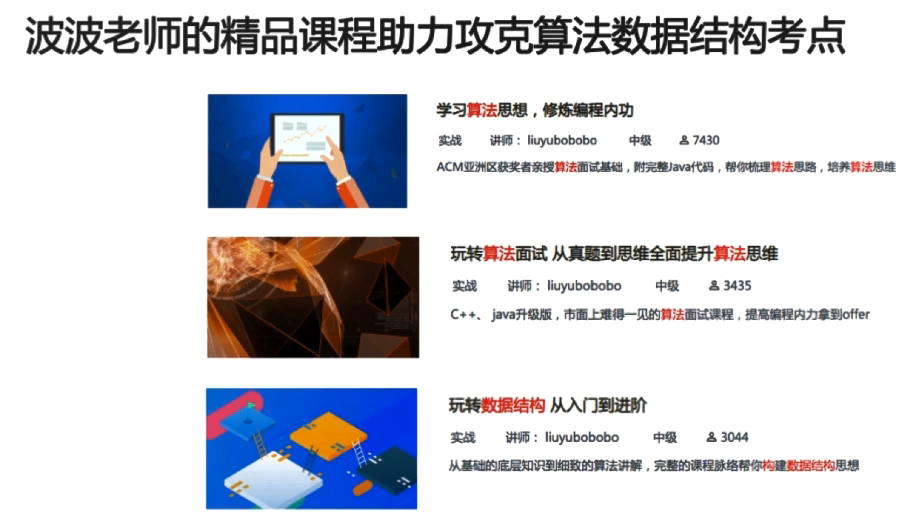
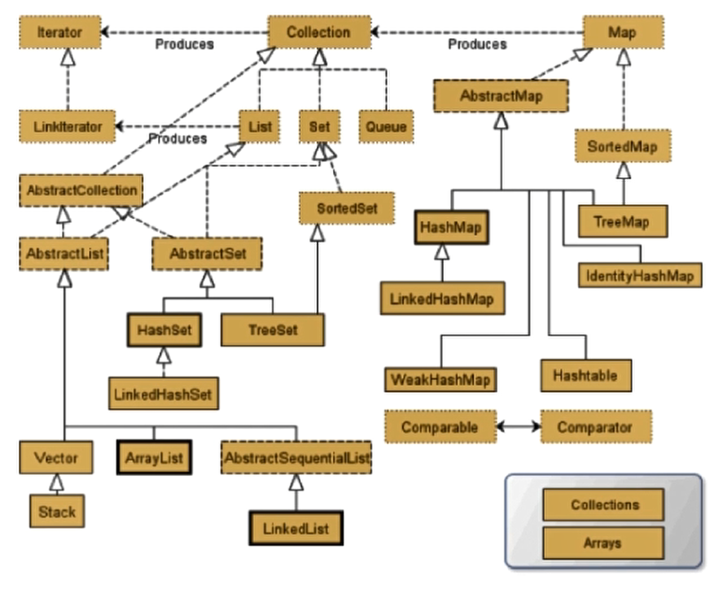
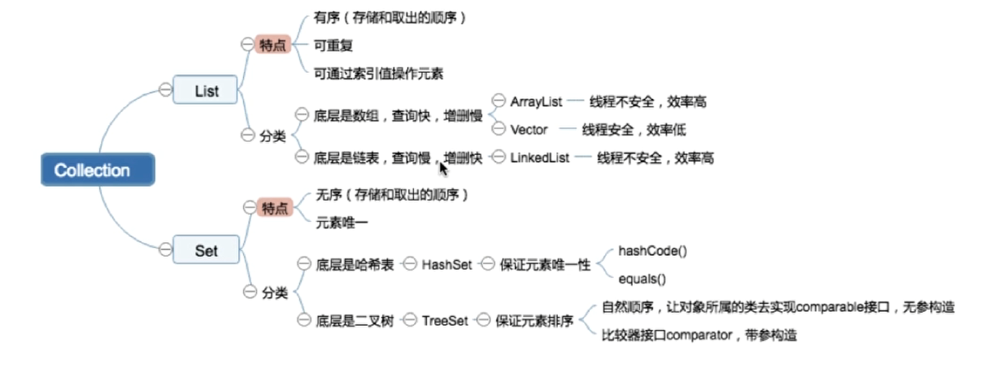
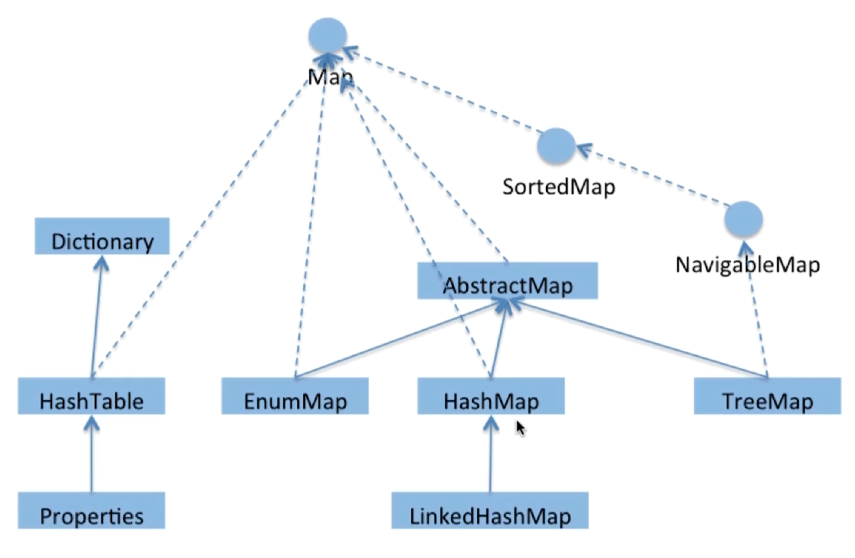
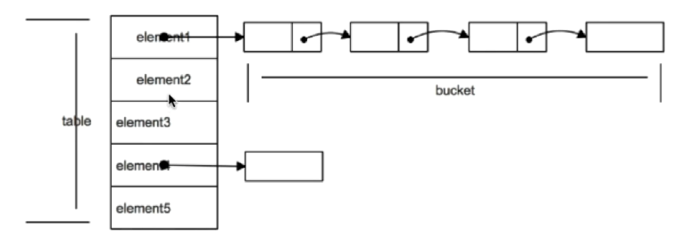
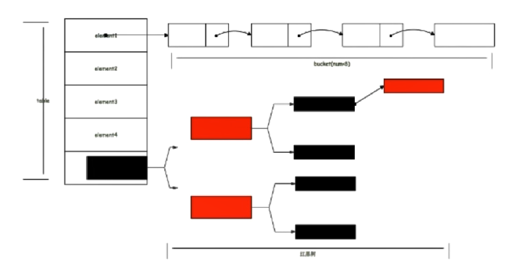

# Collection体系

Java集合框架**数据结构考点**：

- 数组和链表的区别；
- 链表的操作，如反转，链表环路检测，双向链表，循环链表相关操作；
- 队列，栈的应用；
- 二叉树的遍历方式及其递归和非递归的实现；
- 红黑树的旋转；

**算法考点：**

- 内部排序：如递归排序、交换排序（冒泡、快排）、选择排序、插入排序；
- 外部排序：应掌握如何利用有限的内存配合海量的外部存储来处理超大的数据集，写不出来也要有相关的思路。

**考点扩展：**

- 哪些排序是不稳定的，稳定意味着什么
- 不同数据集，各种排序最好或最差的情况
- 如何优化算法








详细的介绍见 Collection.xmind

# Map

用于保存<key,value>键值对。

key是不可重复的，用于标识集合里的每项数据。

value则可以重复。

key是由set保存的，因此不可重复。

value是由collection保存的。



### HashMap、HashTable、ConccurentHashMap的区别？

HashMap（Java8以前）：数组+链表

​	性能恶化：从O（1）变成O（n）



HashMap（Java8及以后）：数组+链表+红黑树

​	TREEIFY_ THRESHOLD

​	最坏性能从O（n）提高到O（logn）

​	代码实现：

```
public HashMap() {//懒加载
    this.loadFactor = DEFAULT_LOAD_FACTOR; // all other fields defaulted
}

transient Node<K,V>[] table;

//当bin count桶内数目大于8时进行树化
static final int TREEIFY_THRESHOLD = 8; 

//当bin count桶内数目小于6时退化回链表
static final int UNTREEIFY_THRESHOLD = 6;

//加载因子
static final float DEFAULT_LOAD_FACTOR = 0.75f;
```



**HashMap:put方法的逻辑：**
1、如果HashMap未被初始化过，则初始化2、对Key求Hash值，然后再计算下标
3、如果没有碰撞，直接放入桶中
4、如果碰撞了，以链表的方式链接到后面
5、如果链表长度超过阀值，就把链表转成红黑树6、如果链表长度低于6，就把红黑树转回链表7、如果节点已经存在就替换旧值
8、如果桶满了（容量16*加载因子0.75），就需要 resize（扩容2倍后重排）

HashMap：如何有效减少碰撞？

- 哈希函数：促使元素位置分布均匀，减少碰撞机率

- 使用final对象来做key，并采用合适的equals() 和hashCode()方法

HashMap：扩容的问题

- 多线程环境下，调整大小会存在条件竞争，容易造成死锁
- rehashing是一个比较耗时的过程

总结：

- 成员变量：数据结构，树化阈值
- 构造函数：延迟创建
- put和get的流程
- 哈希算法，扩容，性能