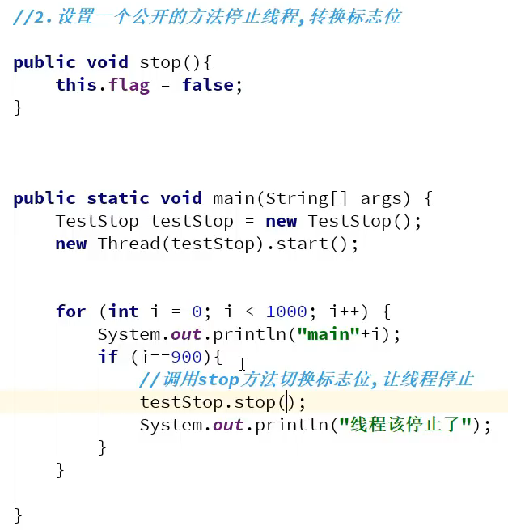
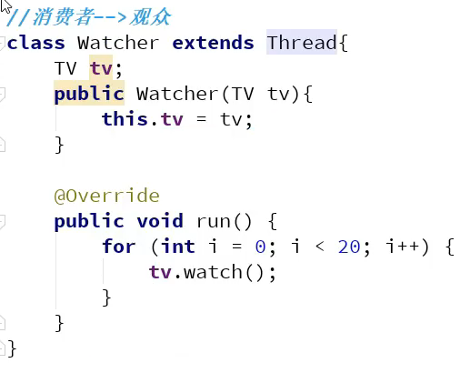
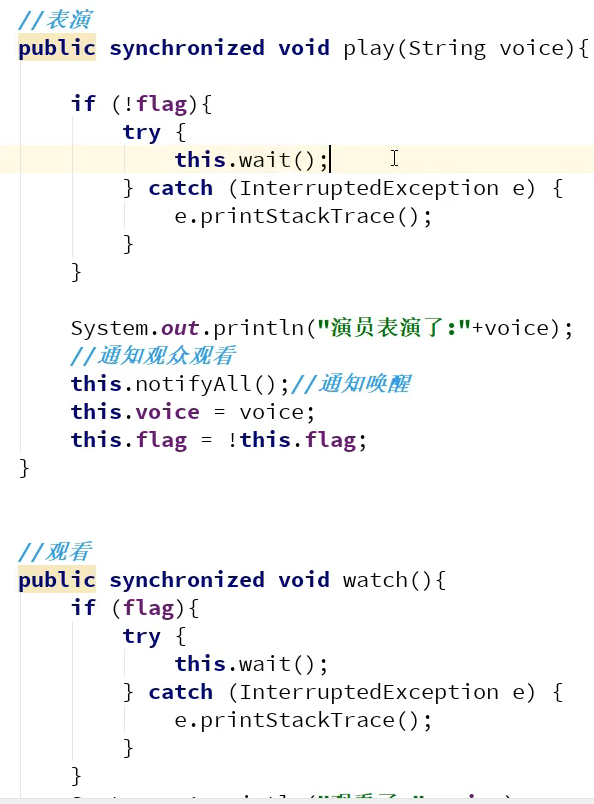

# 多线程2

P11-

## 线程五大状态

### 线程停止

### 线程停止

### 线程休眠

 

#### 模拟网络延时

 

#### 模拟网络倒计时

 

 

### 线程礼让

 

#### 线程强制执行

 

#### 观测线程状态

#### 线程优先级

 

### 守护线程

>  gc线程：守护线程

> 用户线程一旦结束，守护线程也会自动停止了。

## 线程同步

### 三大不安全案例

### 同步方法

### JUC安全

concurrent包，并发安全的包

### 死锁

## 高级部分

### Lock锁

ReentrantLock 可重入锁。

 

## 线程协作（通信）

### 管程法（利用缓冲区解决

### 信号灯法

标志位解决。

信号灯法：生产一个就马上通知了。

### 线程池

