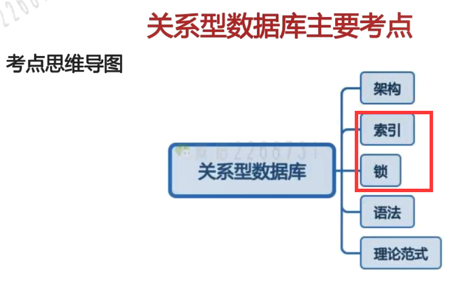
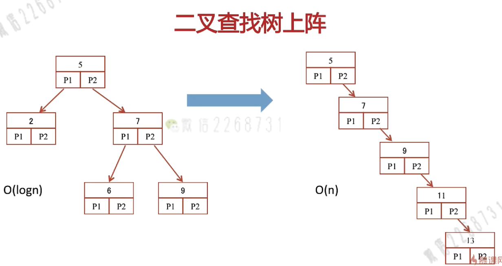
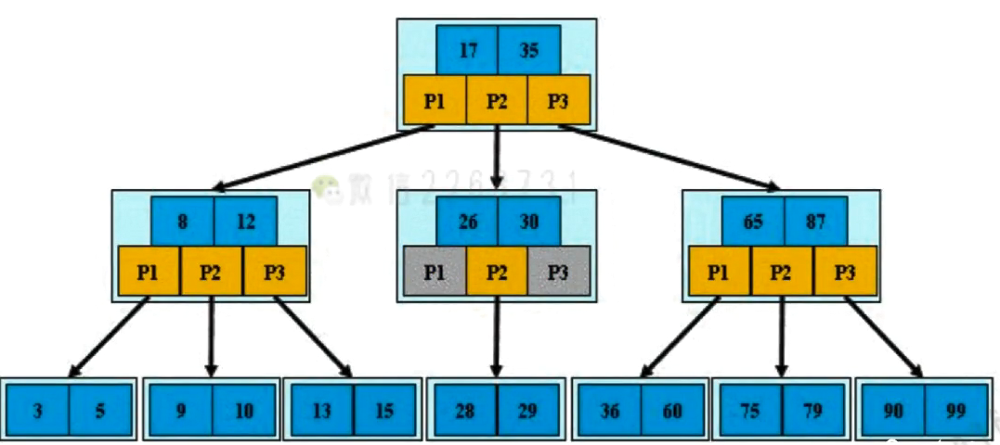
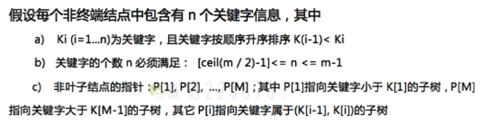
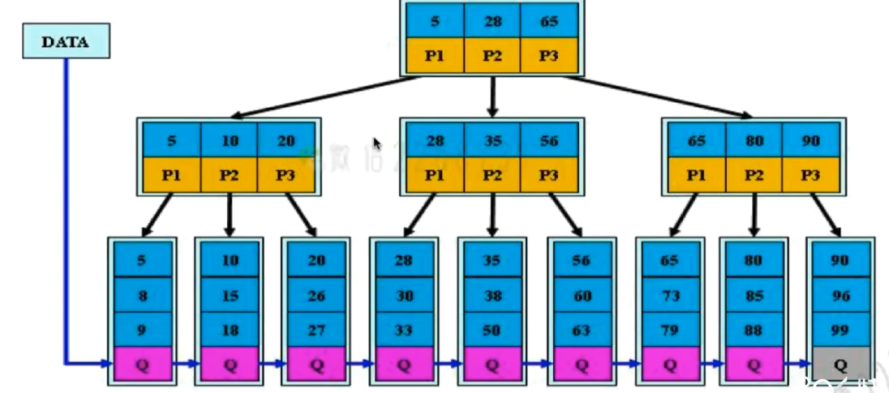
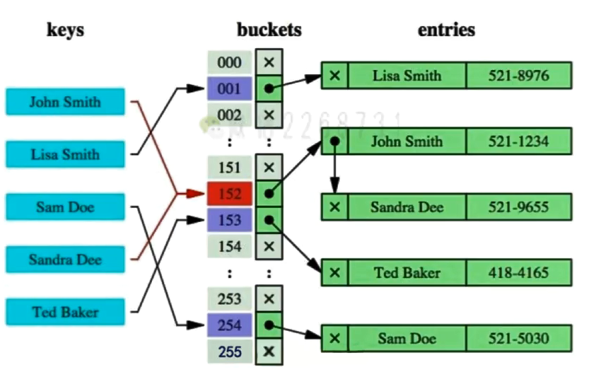
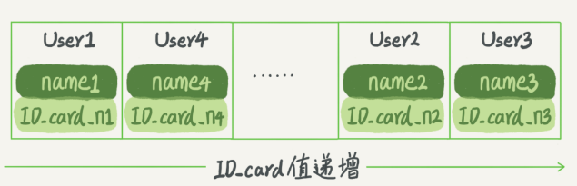
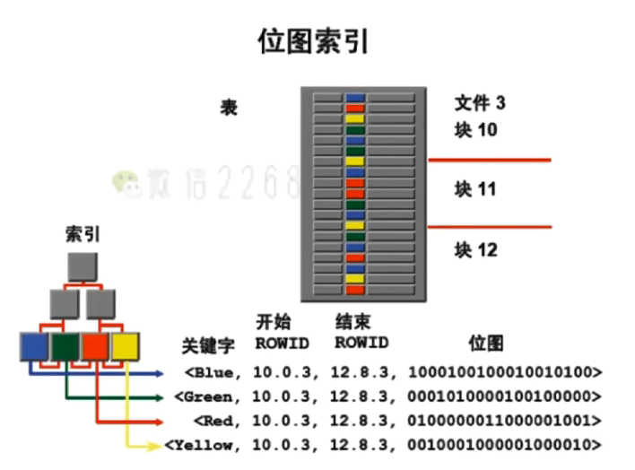
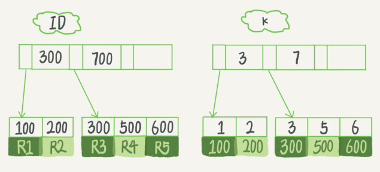

## 架构

见点点本。

## 日志

见点点本。

## 索引

### 1.为什么要使用索引？

表很大的情况下，进行全表扫描很慢。因此需要借助索引提高查询的速度。就像目录一样。

### 2.什么样的信息能成为索引？

主键、唯一键以及普通键等。

### 3.索引的数据结构

- 二叉查找树
- B Tree
- B+ Tree
- Hash结构进行查找

#### 运用二叉查找树

平衡二叉树：任意子树的高度差小于2。折半搜索 O(logn)

但对于数据的插入、删除较耗时 

索引不止存在内存中，还要写到磁盘上。

影响数据库的查询速度的瓶颈在于IO操作。

一次IO读入根节点，又一次IO读入右子节点数据块。检索的深度，即IO次数。

而不论是普通的二叉查找树、红黑树，每个节点都只有两个子节点。数据量大的情况下，势必会导致树的高度很高。

那有没有办法让树变矮一点那？那就让每个节点存储的数据多一点。

为了让一个查询尽量少地读磁盘，就必须让查询过程访问尽量少的数据块。那么，我们就不应该使用二叉树，而是要使用“N 叉”树。这里，**“N 叉”树中的“N”取决于数据块的大小。**

#### B 树

每个节点有M个孩子，M阶B树。通常m是很大的。

定义：

>根节点至少包括两个孩子
>
>树中每个节点最多含有m个孩子（m>=2）
>
>除根节点和叶节点外，其他每个节点至少有ceil（m/2）向上取整个孩子
>
>所有叶子节点都位于同一层

查找效率同二叉查找树。

且B树有自己的方式实现节点的增加、删除，合并节点，使其查找性能不发生退化。

#### B+树

B+树是B树的变体，其定义基本与B树相同，除了：

>非叶子节点的子树指针与关键字个数相同
>
>非叶子节点的子树指针P[i]，指向关键字值[K[i]，K[i+1]）的子树
>
>非叶子节点仅用来索引，**数据都保存在叶子节点中**
>
>所有叶子节点均有一个链指针指向下一个叶子结点（方便进行范围查询）

非叶子节点只存储索引，不存储数据，就可以存储更多的关键字。因此B+树可以更矮。

B+Tree更适合用来做存储索引
>B+树的磁盘读写代价更低（每个节点存储的关键字更多，树的高度低）
>B+树的查询效率更加稳定（每次查询都要查询到叶子节点）
>B+树更有利于对数据库的扫描（对链接起来的叶子节点进行遍历即可）

#### Hash索引

缺点
- 只适用于等值查询的场景，不能进行 范围查询。（适用于memcached等NoSQL引擎）
- 遇到大量Hash值相等的情况后（其实又变成了红黑树）性能并不一定就会比B-Tree索引高

#### 有序数组

有序数组在**等值查询**和**范围查询**场景中的性能就都非常优秀。

如果你要查 ID_card_n2 对应的名字，用二分法就可以快速得到，这个时间复杂度是 O(log(N))。

如果仅仅看查询效率，有序数组就是最好的数据结构了。但是，在需要更新数据的时候就麻烦了，你往中间插入一个记录就必须得挪动后面所有的记录，成本太高。

所以，有序数组索引只适用于**静态存储引擎**。

#### BitMap索引

缺点：

- 只适用于 字段值 是固定的，比如“男”“女”这样。
- 锁的力度很大

### 4.InnoDB的索引模型

每一个索引在 InnoDB 里面对应一棵 B+ 树。

假设，我们有一个主键列为 ID 的表，表中有字段 k，并且在 k 上有索引。

索引类型分为主键索引和非主键索引。

- 主键索引的叶子节点存的是整行数据。在 InnoDB 里，主键索引也被称为聚簇索引（clustered index）。
- 非主键索引的叶子节点内容是主键的值。在 InnoDB 里，非主键索引也被称为二级索引（secondary index）。

基于主键索引和普通索引的查询有什么区别？

- 如果语句是 select * from T where ID=500，即主键查询方式，则只需要搜索 ID 这棵 B+ 树；
- 如果语句是 select * from T where k=5，即普通索引查询方式，则需要先搜索 k 索引树，得到 ID 的值为 500，再到 ID 索引树搜索一次。这个过程称为**回表**。
