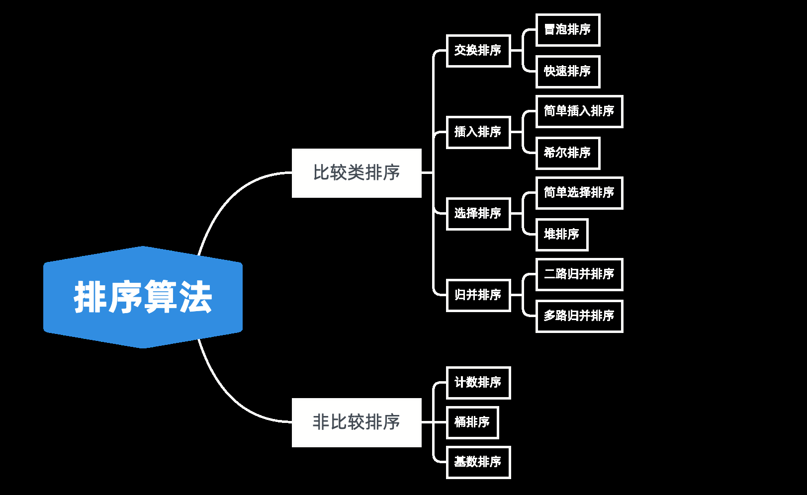
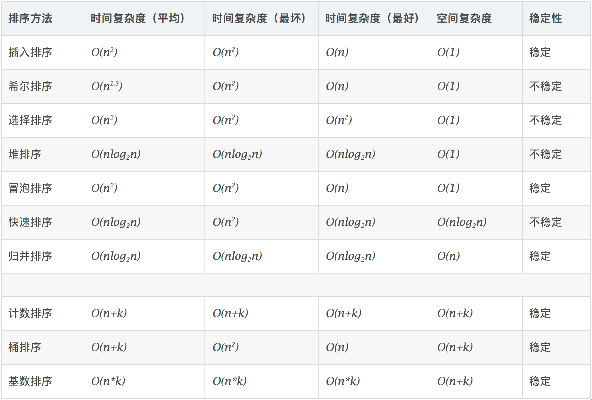

**1.比较类排序：**

通过比较来决定元素间的相对次序，由于其时间复杂度不能突破o（nlogn），因此也称为非线性时间比较类排序。

**2.非比较类排序：**

不通过比较来决定元素间的相对次序，它可以突破基于比较排序的时间下界，以**线性时间**运行，因此也称为线性时间非比较类排序。

常用于 整型 的排序








## 初级排序 O(n^2)
### **1.选择排序（Selection Sort）**

每次找最小值，然后放到待排序数组的起始位置。

不稳定：最小值和首位交换的过程可能会破坏稳定性。比如数列：[2, 2, 1]，在选择排序中第一次进行交换时，原数列中的两个 2 的相对顺序就被改变了

### **2.插入排序（Insertion Sort）**

从前到后逐步构建有序序列；对于未排序数据，在已排序序列中从后向前扫描，找到相应位置并插入。

### **3.冒泡排序（Bubble Sort）**

嵌套循环，每次查看相邻的元素如果逆序，则交换。

稳定：只有左边的数字大于右边的数字时才会发生交换，相等的数字之间不会发生交换，所以它是稳定的。

#### 高级排序-O（N*LogN）

**1.快速排序（Quick Sort）**
数组取标杆 pivot，将小元素放 pivot左边，大元素放右侧，（此时pivot就是最终位置）；然后依次对右边和右边的子数组继续快排；以达到整个序列有序。

```java
//写个快排，竟然写出了无数个错误- -
public static void quickSort(int[] array){
    quickSort(array,0,array.length-1);
}

public static void quickSort(int[] array, int begin, int end){
    if(begin>=end) return ;
    int middle=partation(array, begin,end);
    quickSort(array,begin,middle-1);
    quickSort(array,middle+1,end);
}

private static int partation(int[] array, int left, int right) {
    //随机选择pivot
    Random random=new Random();
    int r=left+random.nextInt(right-left+1);//nextInt[,)

    int pivot=right,counter=left;
    swap(array,right,r);
    for(int i=left;i<right;i++){
        if(array[i]<array[pivot]){
            swap(array,i,counter);
            counter++;
        }
    }
    swap(array,counter,pivot);
    pivot=counter;
    return pivot;
}
```


**2.归并排序（Merge Sort）-分治**

1.把长度为n的输入序列分成两个长度为n/2的子序列；
2.对这两个子序列分别采用归并排序；
3.将两个排序好的子序列合并成一个最终的排序序列。

  

 如图所示，我们申请一个临时数组 tmp，大小与 A[p...r]相同。我们用两个游标 i 和 j，分别指向 A[p...q]和 A[q+1...r]的第一个元素。比较这两个元素 A[i]和 A[j]，如果 A[i]<=A[j]，我们就把 A[i]放入到临时数组 tmp，并且 i 后移一位，否则将 A[j]放入到数组 tmp，j 后移一位。继续上述比较过程，直到其中一个子数组中的所有数据都放入临时数组中，再把另一个数组中的数据依次加入到临时数组的末尾，这个时候，临时数组中存储的就是两个子数组合并之后的结果了。最后再把临时数组 tmp 中的数据拷贝到原数组 A[p...r]中。 


```java
public static void mergeSort(int[] array,int left,int right){
	if (right <=left)return; 
    int mid=(left +right)>>1;//(left +right)/2
	mergeSort(array,left,mid); 
    mergeSort(array,mid +1,right); 
    merge(array,left,mid,right);
}

public static void merge（int[]arr，int left，int mid，int right）{
	int[]temp=new int[right-left+1]；//中间数组
    inti=left，j=mid+1，k=0;
    while（i<=mid&&j<=right）{
		temp[k++]=arr[i]<=arr[j]？arr[i++]：arr[j++];
    }
    while（i<=mid）temp[k++]=arr[i++];
    while（j<=right）temp[k++]=arr[j++];
    for（int p=0；p<temp.length；p++）{
		arr[left+p]=temp[p];
    }
//也可以用 system.arraycopy（a，start1，b，start2，length）
```

归并和快排具有相似性，但步骤顺序相反

归并：先排序左右子数组，然后合并两个有序子数组

快排：先调配出左右子数组，然后对于左右子数组进行排序

#### 特殊排序-O（n）
**1.计数排序（Counting Sort）**
计数排序要求输入的数据必须是有确定范围的整数。将输入的数据值转化为键存储在额外开辟的数组空间中；然后依次把计数大于1的填充回原数组
**2.桶排序（Bucket Sort）**
桶排序（Bucket sort）的工作的原理：假设输入数据服从均匀分布，将数据分到有限数量的桶里，每个桶再分别排序（有可能再使用别的排序算法或是以递归方式继续使用桶排序进行排）。
**3.基数排序（Radix Sort）**
基数排序是按照低位先排序，然后收集；再按照高位排序，然后再收集；依次类推，直到最高位。有时候有些属性是有优先级顺序的，先按低优先级排序，再按高优先级排序。

排序动画演示：

https://www.cnblogs.com/onepixel/p/7674659.html
• https://www.bilibili.com/video/av25136272
• https://www.bilibili.com/video/av63851336