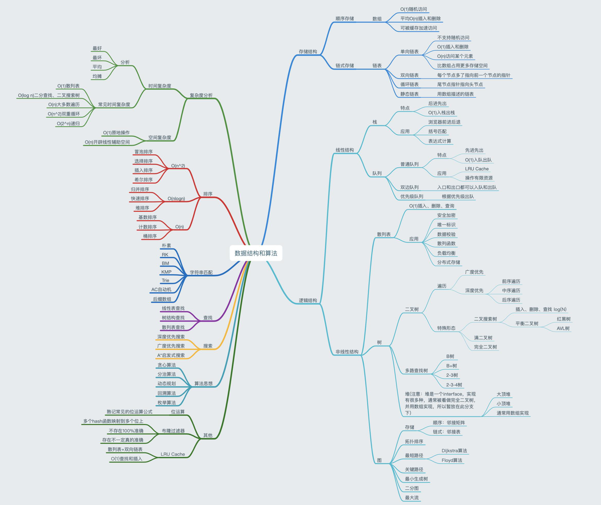

刷题就是要 刻意练习。


## 数组、链表、跳表

数组和链表是最基本的两个 一维线性存储结构。二者的区别在于**底层实现方式**和是否能够做到**随机访问**。

跳表是一种典型的升维思想的体现，空间换时间。应用于Redis中的zset有序列表中。对标红黑树。

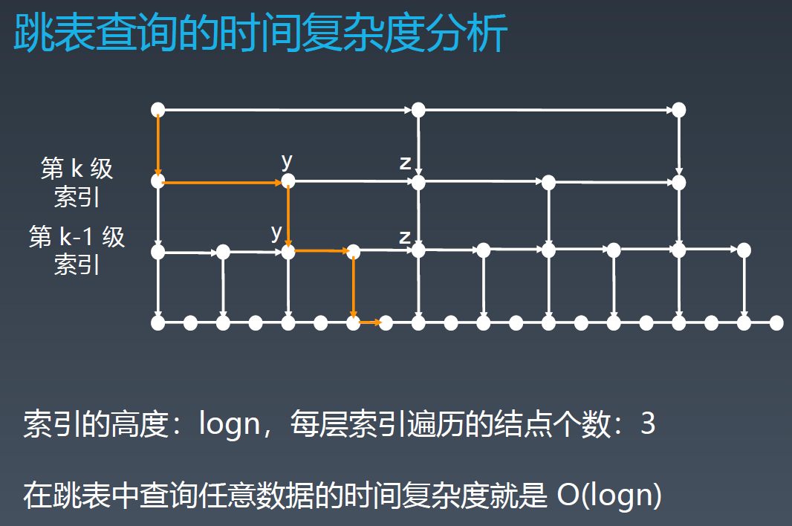

### 数组题目：

#### [11. 盛最多水的容器](https://leetcode-cn.com/problems/container-with-most-water/)

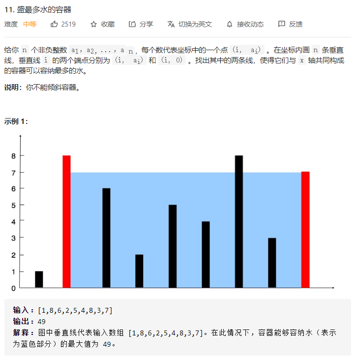

最优 双指针法，哪边小就换哪边的。

#### [283. 移动零](https://leetcode-cn.com/problems/move-zeroes/)

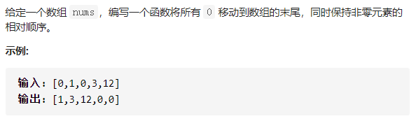

index=0维护非零元素的界限；从前向后遍历，碰到非0元素，就与index交换。

#### [70. 爬楼梯](https://leetcode-cn.com/problems/climbing-stairs/)

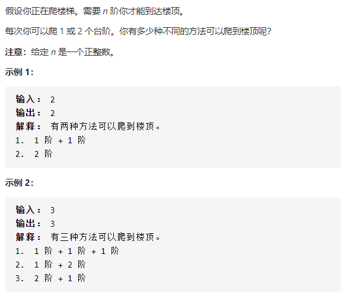

dp[i]表示到达第i阶的方法数。dp[i]=dp[i-1]+dp[i-2]。初始：dp[1]=1,dp[2]=2。

也可以使用三个变量互相交换。

#### [1. 两数之和](https://leetcode-cn.com/problems/two-sum/)

```java
class Solution {
    //[2..] 遍历nums，看是否存在target-nums[i]，存在即返回两个下标
    //否则就 将自己加入到map中
    public int[] twoSum(int[] nums, int target) {
        Map<Integer,Integer> map=new HashMap<>();
        for(int i=0;i<nums.length;i++){
            if(map.containsKey(target-nums[i])){
                return new int[]{map.get(target-nums[i]),i};
            }
            map.put(nums[i], i);
        }
        return new int[]{};
    }
}
```


#### [15. 三数之和](https://leetcode-cn.com/problems/3sum/)

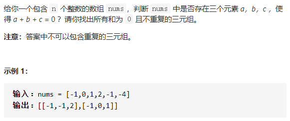

首先对数组排序 ，固定一个数字，另外两个数字 双指针，向中间移动。若和太大了，那右指针向左移动，反之亦然。

**注意：**答案中不可以包含重复的三元组。因此要保证固定的数字不能是重复的。

#### [66. 加一](https://leetcode-cn.com/problems/plus-one/)

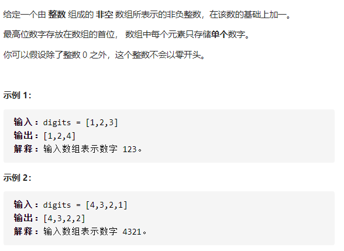

```java
class Solution {
    //最后一位加1，若%10==0，则循环向前进位加一
    public int[] plusOne(int[] digits) {
        int n=digits.length;
        int idx=n-1,mod=0;
        while(idx>=0){
            mod=(digits[idx]+1)%10;
            if(mod==0){
                digits[idx]=0;
                idx--;
            }else{
                digits[idx]=mod;
                return digits;
            }
        }
        int[] res=new int[n+1];
        res[0]=1;
        return res;
    }
}
```


### 链表题目：

#### [206. 反转链表](https://leetcode-cn.com/problems/reverse-linked-list/)

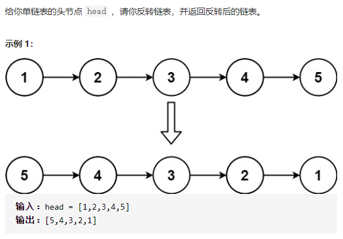

```java
class Solution {
    //[5]
    public ListNode reverseList(ListNode head) {
        ListNode pre=null;//第一个节点要指向pre
        ListNode curr=head;
        while(curr!=null){
            ListNode temp=curr.next;
            curr.next=pre;
            pre=curr;
            curr=temp;
        }
        return pre;//最后返回pre
    }
}
```

#### [24. 两两交换链表中的节点](https://leetcode-cn.com/problems/swap-nodes-in-pairs/)

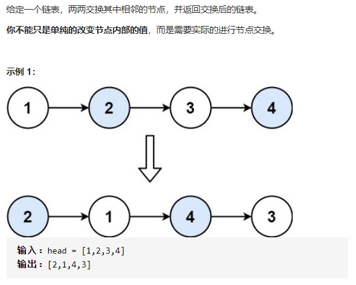

```java
class Solution {
    //【c-1】经典基础题目 手动画图即可模拟
    public ListNode swapPairs(ListNode head) {
        ListNode dummyNode=new ListNode(0);
        dummyNode.next=head;
        ListNode pre=dummyNode;
        ListNode curr=head;
        while(curr!=null && curr.next!=null){   
            ListNode node2=curr.next;
            curr.next=node2.next;
            node2.next=curr;
            pre.next=node2;
            pre=curr;
            curr=curr.next;
        }
        return dummyNode.next;
    }
}
```

#### [141. 环形链表](https://leetcode-cn.com/problems/linked-list-cycle/)

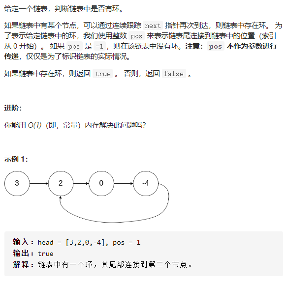

```java
public class Solution {
    //1 week
    //s1 哈希表，碰到重复的键，说明重复了
    public boolean hasCycle(ListNode head) {
        Set<ListNode> set=new HashSet<>();
        while(head!=null){
            if(set.add(head)){
                head=head.next;
                continue;
            }else{
                return true;
            }
        }
        return false;
        
    }

    //s2 快慢指针，指针相遇则说明有环 o(1)的空间
    public boolean hasCycle(ListNode head) {
        if(head==null) return false;
        if(head.next==null) return false;
        ListNode slow=head;
        ListNode fast=head.next;

        while(fast!=null&&fast.next!=null){
            slow=slow.next;
            fast=fast.next.next;
            if(slow==fast){
                return true;
            }
        }
        return false;
    }
}
```

#### [142. 环形链表 II](https://leetcode-cn.com/problems/linked-list-cycle-ii/)

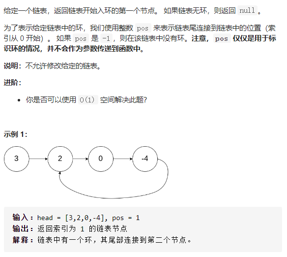

s1 哈希集合，检测到重复的那个就是环节点

#### [25. K 个一组翻转链表](https://leetcode-cn.com/problems/reverse-nodes-in-k-group/)

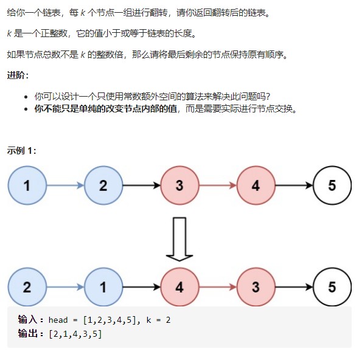

```java
class Solution {
    //[4] 链表的两个翻转、K个翻转，都需要一个dummyNode头结点和pre指针
    // 链表的翻转，批量操作，都需要pre 和curr(head)
    public ListNode reverseKGroup(ListNode head, int k) {
        ListNode dummyNode=new ListNode(0);
        dummyNode.next=head;
        ListNode pre=dummyNode;

        ListNode tail=pre;
        while(pre!=null){
            tail=pre;
            //判断是否有够k个
            for(int i=0;i<k;i++){
                tail=tail.next;
                if(tail==null){
                    return dummyNode.next;
                }
            }

            ListNode l[]=reverse(head,tail);
            head=l[0];
            tail=l[1];

            pre.next=head;
            pre=tail;
            head=pre.next;

        }
        
        return dummyNode.next;
    }

    public ListNode[] reverse(ListNode head, ListNode tail){//翻转head到tail之间的元素
        ListNode pre=tail.next;
        ListNode curr=head;
        while(pre!=tail){
            ListNode temp=curr.next;
            curr.next=pre;
            pre=curr;
            curr=temp;
        }
        return new ListNode[]{tail,head};
    }
}
```

#### [26. 删除有序数组中的重复项](https://leetcode-cn.com/problems/remove-duplicates-from-sorted-array/)

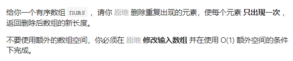

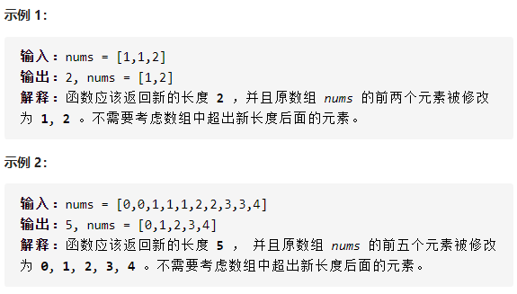

```java
class Solution {
    //[c-2] 双指针
    // l指向不重复的末尾（用于维护处理完的数组），r指向遍历的元素，
    public int removeDuplicates(int[] nums) {
        int l=0,r=1;
        int cnt=1;
        while(r<nums.length){
            if(nums[l]!=nums[r]){//碰到不相等的r，那就填充 不重复的那个数组
                nums[l+1]=nums[r];
                l++;r++;cnt++;
            }else{//相等那就r++继续向后找 不相等的元素
                r++;
            }
        }
        return cnt;
    }
}
```

#### [189. 旋转数组](https://leetcode-cn.com/problems/rotate-array/)

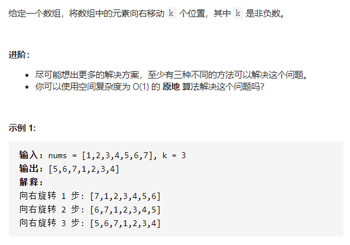

```java
class Solution {
    //1 week
    //s1 新数组，直接移入对应的下表位置处
    //s2 翻转三次
    public void rotate(int[] nums, int k) {
        myReverse(nums,0,nums.length-1);
        myReverse(nums,0,k%nums.length-1);
        myReverse(nums, k%nums.length, nums.length-1);

    }

    void myReverse(int[] nums,int i,int j){
        while(i<j){
            int temp=nums[i];
            nums[i]=nums[j];
            nums[j]=temp;
            i++;
            j--;
        }
    }
}
```

#### [21. 合并两个有序链表](https://leetcode-cn.com/problems/merge-two-sorted-lists/)

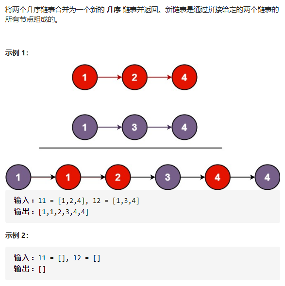

```java
class Solution {
    //[c-1] 
    //dummyHead
    public ListNode mergeTwoLists(ListNode l1, ListNode l2) {
        ListNode dummyHead=new ListNode(0);
        ListNode curr=dummyHead;
        while(l1!=null && l2!=null){
            if(l1.val<=l2.val){
                curr.next=l1;
                l1=l1.next;
            }else{
                curr.next=l2;
                l2=l2.next;
            } 
            curr=curr.next;
        }
        if(l1!=null) curr.next=l1;
        if(l2!=null) curr.next=l2;
        return dummyHead.next;

    }
}
```

#### [88. 合并两个有序数组](https://leetcode-cn.com/problems/merge-sorted-array/)

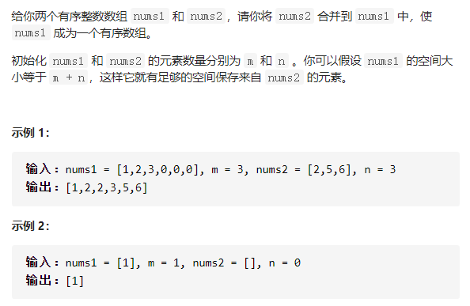

```java
class Solution {
    //c-1 双指针
    //从后向前处理
    public void merge(int[] nums1, int m, int[] nums2, int n) {
        int p1=m-1,p2=n-1,index=m+n-1;
        while(p1>=0 && p2>=0){
            if(nums1[p1]<=nums2[p2]){
                nums1[index]=nums2[p2];
                index--;
                p2--;
            }else{
                nums1[index]=nums1[p1];
                index--;
                p1--;
            }
        }
        while(p1>=0){
            nums1[index]=nums1[p1];
            index--;
            p1--;
        }
        while(p2>=0){
            nums1[index]=nums2[p2];
            index--;
            p2--;
        }

    }
}
```


## 栈、队列、双端队列、优先队列

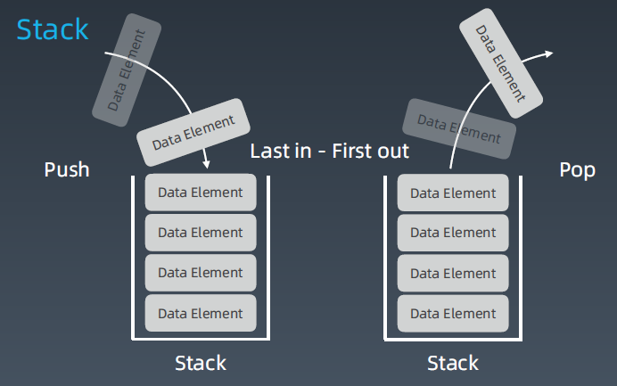

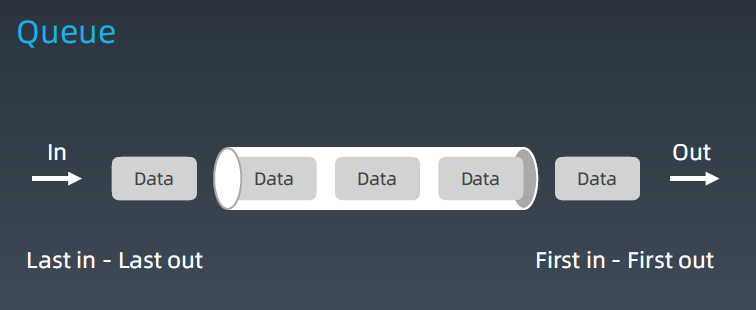

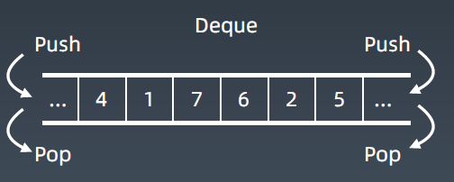

一般用Deque来做栈使用。addLast removeLast

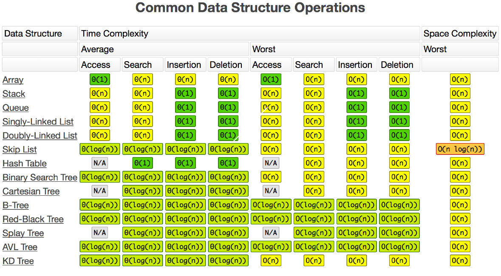

**PriorityQueue**：默认是有小到大。

### 栈 题目：

#### [20. 有效的括号](https://leetcode-cn.com/problems/valid-parentheses/)

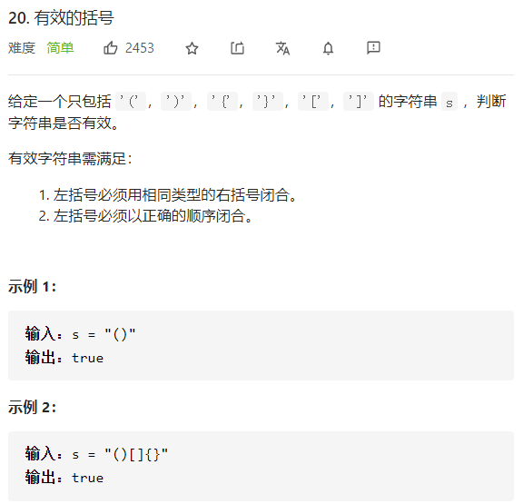

遍历，碰到左括号入栈，碰到右括号出栈，通过map<右括号，左括号>检查是否匹配。

#### [155. 最小栈](https://leetcode-cn.com/problems/min-stack/)

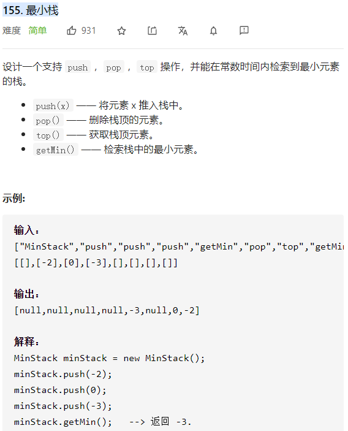

要求在常数时间内，get到栈内的最小元素。

本质：以空间换时间。

S1，栈内保存数组。在保存栈元素的同时，保存此时的栈内最小值。

S2，辅助栈，用辅助栈保存当前位置对应的栈内最小值。

#### [84. 柱状图中最大的矩形](https://leetcode-cn.com/problems/largest-rectangle-in-histogram/)

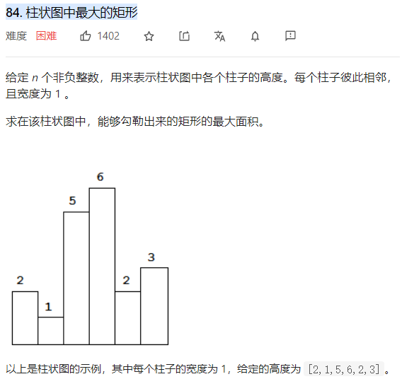

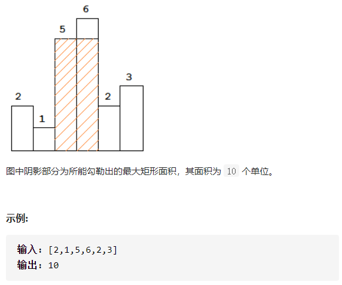

暴力法：遍历每个柱子，以当前柱子为中心，向左右扩展（若左右高于自己才扩展）

单调栈法：

https://leetcode-cn.com/problems/largest-rectangle-in-histogram/solution/bao-li-jie-fa-zhan-by-liweiwei1419/

维持单调递增的栈。栈内保存柱子的下标，以下标对应的高度衡量大小。

后来的元素若是比栈顶元素矮，则当前栈顶元素的面积可以计算了。

#### 😢[42. 接雨水](https://leetcode-cn.com/problems/trapping-rain-water/)


S1 动态编程

记录下左侧的最高柱子和右侧的最高柱子。判断 此二者较低的那个 是否比自己高，若比自己高，那就可以存储一点雨水。

S2 单调递减栈

当碰到更低的柱子，那就入栈。

碰到更高的柱子，出栈，接雨水。且栈顶下面的也比自己高！

```java
class Solution {
    // 采用单调递减栈
    public int trap(int[] height) {
        int res = 0;
        Stack<Integer> stack = new Stack<>();
        for (int i = 0; i < height.length; i++) {
            while (!stack.isEmpty() && height[stack.peek()] < height[i]) {
                int curr = stack.peek();
                stack.pop();
                if (stack.isEmpty()) {
                    break;
                }
                int left = stack.peek();
                int right = i;
                int h = Math.min(height[left], height[right]) - height[curr];
                res += (right - left - 1) * h;
            }
            stack.push(i);
        }
        return res;
    }
}
```


### 队列题目：

#### [239. 滑动窗口最大值](https://leetcode-cn.com/problems/sliding-window-maximum/)

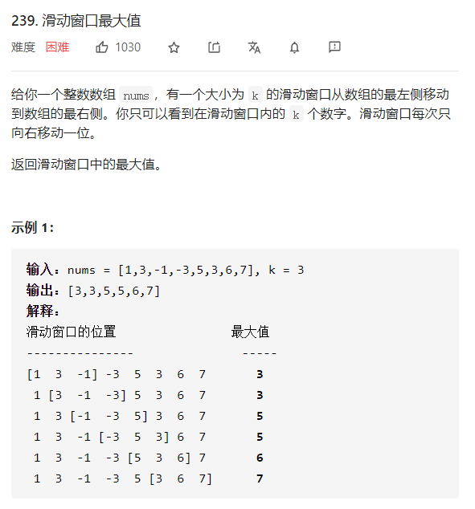

采用【单调队列】保证由头到尾是单调递减的队列。需要使用**双端队列**实现保证 单调的操作。

首先将前k个元素入队列。

入队列的规则：从尾部入队，碰到比自己小的就将小的出队后，自己再入队，从而保证队列的单调。

#### [622. 设计循环队列](https://leetcode-cn.com/problems/design-circular-queue/)

#### [641. 设计循环双端队列](https://leetcode-cn.com/problems/design-circular-deque/)


###  哈希表、映射、集合

#### [242. 有效的字母异位词](https://leetcode-cn.com/problems/valid-anagram/)

排序后比较。

#### [49. 字母异位词分组](https://leetcode-cn.com/problems/group-anagrams/)

以排序后的字符串为key，来保存一组异位词。

#### [1. 两数之和](https://leetcode-cn.com/problems/two-sum/)


## 树、二叉树、二叉搜索树

```java
public class TreeNode{
	public int val; 
    public TreeNode left, right; 
    public TreeNode(int val){
		this. val=val; 
        this. left=null; 
        this. right=null;
    }
}
```

二叉搜索树 = 二叉排序树 = 有序二叉树 = 排序二叉树= Binary Search Tree

二叉搜索树，其中序遍历为 由小到大的有序。

树的高度为lgn

### 树 题目：

#### [144. 二叉树的前序遍历](https://leetcode-cn.com/problems/binary-tree-preorder-traversal/)

#### [94. 二叉树的中序遍历](https://leetcode-cn.com/problems/binary-tree-inorder-traversal/)

前中后序遍历的，递归与非递归写法。

#### [429. N 叉树的层序遍历](https://leetcode-cn.com/problems/n-ary-tree-level-order-traversal/)

层序遍历，类似于 广度优先遍历，使用队列实现。

#### [589. N 叉树的前序遍历](https://leetcode-cn.com/problems/n-ary-tree-preorder-traversal/)

```java
public void preOrder(Node root){
    if(root==null) return;
    res.add(root.val);
    for(Node node:root.children){
        preOrder(node);
    }

}
```

## 递归

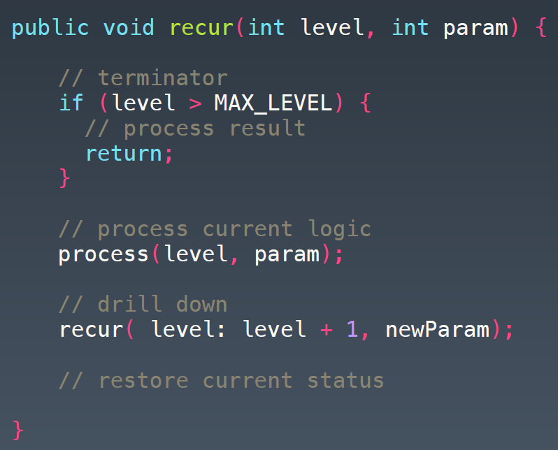

1. 不要人肉进行递归（最大误区）
2. 找到最近最简方法，将其拆解成可重复解决的问题（重复子问题）
3. 数学归纳法思维
4. 画递归树！

### 递归题目：

#### [70. 爬楼梯](https://leetcode-cn.com/problems/climbing-stairs/)

递归，有大量重复递归。

dp[i]表示到达第i阶的方法数。dp[i]=dp[i-1]+dp[i-2]

#### [22. 括号生成](https://leetcode-cn.com/problems/generate-parentheses/)

```java
class Solution {
    //[c-1] dfs 生成括号，
    //注意剪枝 左括号<n ，右括号<=左括号的数量
    public List<String> generateParenthesis(int n) {
        List<String> res=new ArrayList<>();

        dfs(res,n,0,0,"");
        return res;
    }
	//l左括号数目 r右括号数目
    void dfs(List<String> res, int n,int l,int r,StringBuffer s){
        //递归出口
        if(l==n && r==n){
            res.add(s.toString());
            return;
        }

        if(l<n){
            dfs(res,n,l+1,r,s+"(");//注意此处，这么写，没有修改原来的s
        }
        if(r<l){
            dfs(res,n,l,r+1,s+")");
        }

    }
}
```

#### [226. 翻转二叉树](https://leetcode-cn.com/problems/invert-binary-tree/)

```java
class Solution {
    public TreeNode invertTree(TreeNode root) {
        reverse(root);
        return root;
    }

    void reverse(TreeNode root){
        if(root==null) return ;

        TreeNode temp=root.left;
        root.left=root.right;
        root.right=temp;

        reverse(root.left);
        reverse(root.right);

    }
}
```

#### [98. 验证二叉搜索树](https://leetcode-cn.com/problems/validate-binary-search-tree/)

```java
妙！
class Solution {
    //c-1 中序遍历为递增的,递归写法
    long pre = Long.MIN_VALUE; // 记录上一个节点的值，初始值为Long的最小值
        
    public boolean isValidBST(TreeNode root) {
        return inorder(root);
    }

    boolean inorder(TreeNode root){
        //出口
        if(root==null) return true;
		//左子树
        if(!inorder(root.left)){
            return false;
        }
        //当前节点
        if(root.val<=pre){
            return false;
        }
        pre=root.val;
        //右子树
        return inorder(root.right);
    }
}
```

#### [104. 二叉树的最大深度](https://leetcode-cn.com/problems/maximum-depth-of-binary-tree/)

```java
class Solution {
    public int maxDepth(TreeNode root) {
        if(root==null) return 0;

        return Math.max(maxDepth(root.left),maxDepth(root.right))+1;

    }
}
```

#### [111. 二叉树的最小深度](https://leetcode-cn.com/problems/minimum-depth-of-binary-tree/)

```java
class Solution {
    public int minDepth(TreeNode root) {
        if(root==null) return 0;

        return myMin(root);

    }
	//此函数用于返回以root为根的树的最小深度
    int myMin(TreeNode root){
        
        if(root.left==null && root.right==null){//f<0 代表其父节点是叶子
            return 1;
        }
        
        if(root.left==null){
            return myMin(root.right)+1;
        }
        if(root.right==null){
            return myMin(root.left)+1;
        }

        return Math.min(myMin(root.left),myMin(root.right))+1;   
    }
}
```

#### [297. 二叉树的序列化与反序列化](https://leetcode-cn.com/problems/serialize-and-deserialize-binary-tree/)

```java
public class Codec {

    // Encodes a tree to a single string.
    public String serialize(TreeNode root) {
        if(root==null) return "X,";
        String l_S=serialize(root.left);
        String r_S=serialize(root.right);
        //前序遍历 拼接
        return root.val+","+l_S+r_S; //将自身与左右子树的序列化值进行拼接       
    }

    // Decodes your encoded data to tree.
    public TreeNode deserialize(String data) {
        String[] data_array=data.split(",");
        Deque<String> dq=new LinkedList<>(Arrays.asList(data_array));
        return buildTree(dq);
    }

    private TreeNode buildTree(Deque<String> dq){
        String s=dq.poll();
        if(s.equals("X")) return null;
        TreeNode root=new TreeNode(Integer.parseInt(s));
        root.left=buildTree(dq);
        root.right=buildTree(dq);
        return root;
    }

}
```

#### 😢[236. 二叉树的最近公共祖先](https://leetcode-cn.com/problems/lowest-common-ancestor-of-a-binary-tree/)

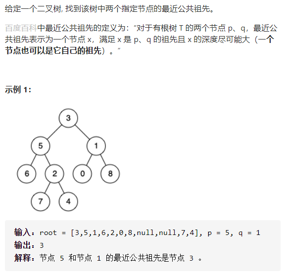

LBLD261

https://leetcode-cn.com/problems/lowest-common-ancestor-of-a-binary-tree/solution/236-er-cha-shu-de-zui-jin-gong-gong-zu-xian-hou-xu/

#### [105. 从前序与中序遍历序列构造二叉树](https://leetcode-cn.com/problems/construct-binary-tree-from-preorder-and-inorder-traversal/)

```java
class Solution {
    //c-1 按照逻辑，递归进行构造即可
    public TreeNode buildTree(int[] preorder, int[] inorder) {
        return buildTreeHelper(preorder, 0, preorder.length-1, inorder, 0, inorder.length-1);

    }

    private static TreeNode buildTreeHelper(int[] preorder, int p_start, int p_end, int[] inorder, int i_start, int i_end) {
        //递归出口：前序、后续为空的时候
        if(p_start>p_end) return null;

        int root_val=preorder[p_start];
        TreeNode root=new TreeNode(root_val);

        //在中序遍历中，找到root_val的位置
        int position_inorder=-1;
        for(int i=i_start;i<=i_end;i++){
            if(inorder[i]==root_val) {
                position_inorder=i;
                break;
            }
        }

        root.left=buildTreeHelper(preorder,p_start+1,p_start+position_inorder-i_start,inorder,i_start,position_inorder-1);
        root.right=buildTreeHelper(preorder, p_start+position_inorder-i_start+1, p_end, inorder, position_inorder+1, i_end);
        return root;

    }
}
```


#### [77. 组合](https://leetcode-cn.com/problems/combinations/)

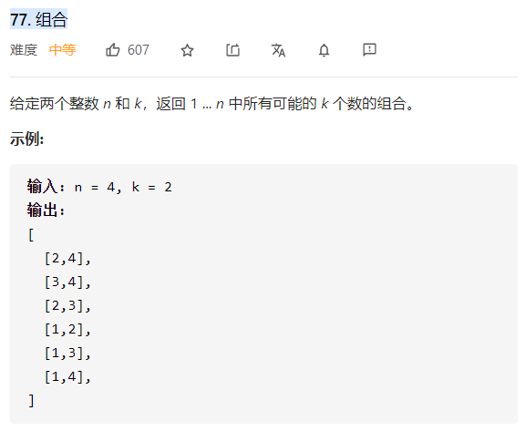

> 递归结构：
> 1.如果组合里有1，那么需要在[2，3，4]里再找1个数；
> 2.如果组合里有2，那么需要在[3，4]里再找1数。注意：这里不能再考虑1，因为包含1的组合，在第1种情况中已经包含。


```java
class Solution {
    //1 day [2]
    public List<List<Integer>> combine(int n, int k) {
        List<List<Integer>> res=new ArrayList<>();
        Deque<Integer> deque=new LinkedList<>();
        if(k<=0 || n<k) return res;

        dfs(n,k,1,res,deque);
        return res;

    }

    void dfs(int n,int k,int begin,List<List<Integer>> res,Deque<Integer> deque )    {
        //终止条件
        if(deque.size()==k){
            res.add(new ArrayList(deque));
            return;
        }

        //遍历
        //for(int i=begin;i<=n-(k-deque.size())+1;i++){
        for(int i=begin;i<=n;i++){
            deque.addLast(i);
            dfs(n, k, i+1, res, deque);
            deque.removeLast();//恢复栈，向上回溯
        }
    }
}
```

#### [46. 全排列](https://leetcode-cn.com/problems/permutations/)

组合：不在乎数字出现的先后顺序，如[1,2]等同于[2,1]

排列：在乎数字的排列顺序，如[1,2]与[2,1]是两个排列


经典的路径回溯，dfs：

```java
class Solution {
    //[c-1] dfs 回溯，无剪枝
    List<List<Integer>> res;
    boolean[] used;
    public List<List<Integer>> permute(int[] nums) {
        res=new ArrayList<>();
        used=new boolean[nums.length]; 

        Deque<Integer> path=new LinkedList<>();
        dfs(nums,path);

        return res;
    }

    void dfs(int[] nums, Deque<Integer> path){
        if(path.size()==nums.length){
            res.add(new ArrayList(path));
            return ;
        }

        for(int i=0;i<nums.length;i++){
            if(used[i]==false){
                used[i]=true;
                path.addLast(nums[i]);
                dfs(nums, path);

                used[i]=false;
                path.removeLast();
            }

        }
    }
}
```

回溯算法精讲：https://leetcode-cn.com/problems/permutations/solution/hui-su-suan-fa-python-dai-ma-java-dai-ma-by-liweiw/

#### [47. 全排列 II](https://leetcode-cn.com/problems/permutations-ii/)

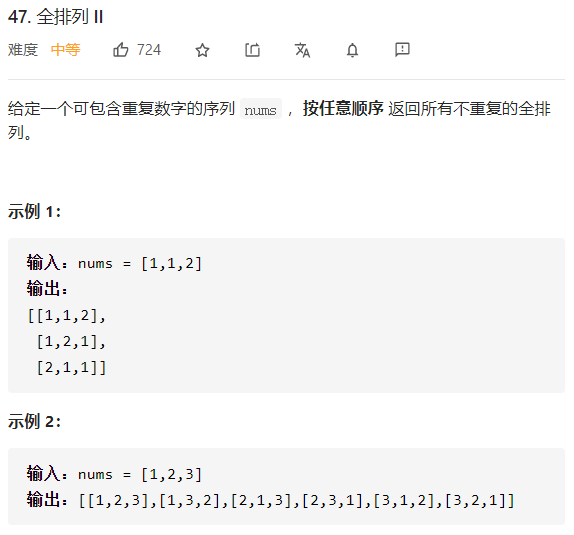

```java
class Solution {
    //【1】
    public List<List<Integer>> permuteUnique(int[] nums) {
        List<List<Integer>> res=new ArrayList<>();
        Deque<Integer> deque=new LinkedList<>();
        boolean[] used=new boolean[nums.length];
        Arrays.sort(nums);//先排序，这样就把重复元素放在了一起

        dfs(nums,res,deque,used);

        return res;
    }

    void dfs(int[] nums,List<List<Integer>> res,Deque<Integer> deque,boolean[] used){
        //终止条件，凑够个数了
        if(deque.size()==nums.length){
            res.add(new ArrayList(deque));
            return ;
        }

        for(int i=0;i<nums.length;i++){
            if(used[i]==true) continue;
            //判断如果和上个元素重复了，那就不用这个元素了
            if(i>0 && nums[i]==nums[i-1] && !used[i-1]) continue;
            
            deque.addLast(nums[i]);
            used[i]=true;
            dfs(nums, res, deque, used);
            deque.removeLast();
            used[i]=false;
        }
    }
}
```

## 堆

Heap：可以迅速找到一堆数中的最大或者最小值的数据结构。

二叉堆：通过完全二叉树来实现（注意：不是二叉搜索树）；

Insert 插入操作
	1.新元素一律先插入到堆的尾部
	2.依次向上调整整个堆的结构（一直到根即可）
HeapifyUp


Delete Max删除堆顶操作
	1.将堆尾元素替换到顶部（即对顶被替代删除掉）
	2.依次从根部向下调整整个堆的结构（一直到堆尾即可）
HeapifyDown

注意：二叉堆是堆（优先队列priority_queue）的一种常见且简单的实现；但是并不是最优的实现。

### 堆题目：

#### [剑指 Offer 40. 最小的k个数](https://leetcode-cn.com/problems/zui-xiao-de-kge-shu-lcof/)

使用容量为k的大顶堆，若新元素比堆顶小，则删除堆顶，将新元素入堆。

```java
    //大顶堆
    public int[] getLeastNumbers(int[] arr, int k) {
        if(k==0) return new int[]{};
        Queue<Integer> q=new PriorityQueue<>((a,b)->b-a);
        for(int i=0;i<arr.length;i++){
            if(q.size()<k){
                q.add(arr[i]);
            }else{
                if(arr[i]<q.peek()){
                    q.poll();
                    q.add(arr[i]);
                }
            }
        }
        int[] res=new int[k];
        int i=0;
        for (Integer integer : q) {
            res[i]=integer;
            i++;
        }
        return res;

    }
```

当然也可以基于partation函数，确定了最小的k个数字之后就返回。

#### 😢[347. 前 K 个高频元素](https://leetcode-cn.com/problems/top-k-frequent-elements/)

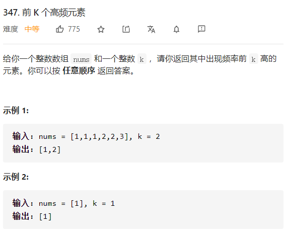

```java
class Solution {
    public List<Integer> topKFrequent(int[] nums, int k) {
        // 使用字典，统计每个元素出现的次数，元素为键，元素出现的次数为值
        HashMap<Integer,Integer> map = new HashMap();
        for(int num : nums){
            if (map.containsKey(num)) {
               map.put(num, map.get(num) + 1);
             } else {
                map.put(num, 1);
             }
        }
        // 遍历map，用最小堆保存频率最大的k个元素
        PriorityQueue<Integer> pq = new PriorityQueue<>(new Comparator<Integer>() {
            @Override
            public int compare(Integer a, Integer b) {
                return map.get(a) - map.get(b);
            }
        });
        for (Integer key : map.keySet()) {
            if (pq.size() < k) {
                pq.add(key);
            } else if (map.get(key) > map.get(pq.peek())) {
                pq.remove();
                pq.add(key);
            }
        }
        // 取出最小堆中的元素
        List<Integer> res = new ArrayList<>();
        while (!pq.isEmpty()) {
            res.add(pq.remove());
        }
        return res;
    }
}
```

#### 😢[剑指 Offer 49. 丑数](https://leetcode-cn.com/problems/chou-shu-lcof/)

小顶堆，要注意去重.

小顶堆在此处的作用就是，每次找到最小的元素，用来生成新的丑数。

```java
class Solution {
    public int nthUglyNumber(int n) {
        int[] factors = {2, 3, 5};
        Set<Long> seen = new HashSet<Long>();
        PriorityQueue<Long> heap = new PriorityQueue<Long>();
        seen.add(1L);
        heap.offer(1L);
        int ugly = 0;
        for (int i = 0; i < n; i++) {
            long curr = heap.poll();
            ugly = (int) curr;
            for (int factor : factors) {
                long next = curr * factor;
                if (seen.add(next)) {
                    heap.offer(next);
                }
            }
        }
        return ugly;
    }
}

```

## 图

待学习

 [07 极客大学-算法训练营-覃超-图.pdf](E:\BaiduNetdiskDownload\极客-算法训练营\000算法讲师课件\07 极客大学-算法训练营-覃超-图.pdf) 

## 分治、回溯

分治：

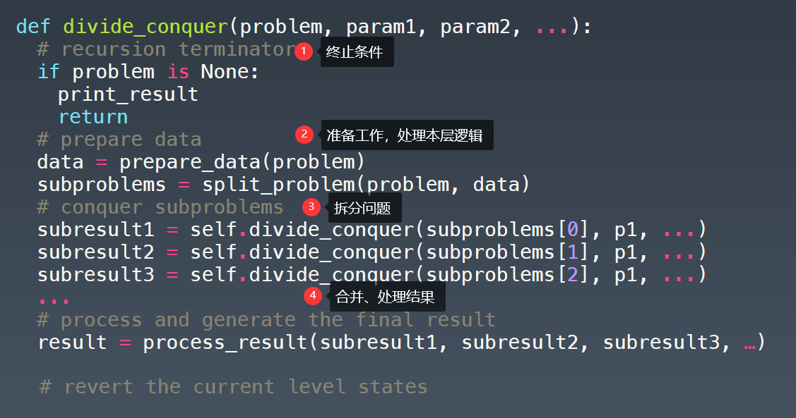

回溯算法精讲：https://leetcode-cn.com/problems/permutations/solution/hui-su-suan-fa-python-dai-ma-java-dai-ma-by-liweiw/


### 分治题目：

#### [50. Pow(x, n)](https://leetcode-cn.com/problems/powx-n/)

2^10 =2^5 *2^5

2^9 = 2^4 * 2^4 * 2

```java
class Solution {
    //c-2
    public double myPow(double x, int n) {
        if(n>=0) return helper(x, n);
        else return helper(1.0/x, -n);
    }

    double helper(double x, int n){
        if(n==0) return 1;

        double y=helper(x, n/2);
        if(n%2==0){
            return y*y;
        }else return y*y*x;
    }

}
```


#### [169. 多数元素](https://leetcode-cn.com/problems/majority-element/)


### 回溯：

#### [78. 子集](https://leetcode-cn.com/problems/subsets/)

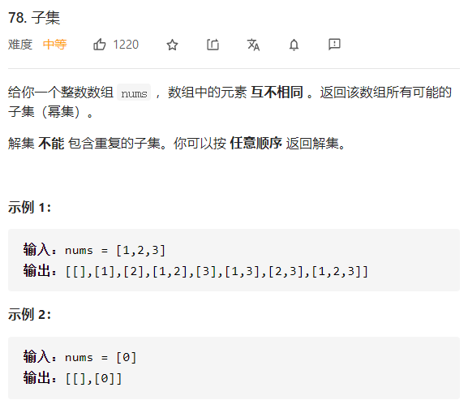

```java
class Solution {
    //c-1 dfs题解：对每个元素，选 与 不选 来做选择。直到到了最后一个元素，即出口
    List<List<Integer>> res=new ArrayList<>();
    public List<List<Integer>> subsets(int[] nums) {
        Deque<Integer> path=new LinkedList<>();
        dfs(0,nums,path);
        return res;
    }

    void dfs(int index,int[] nums,Deque<Integer> path){
        //递归出口
        if(index==nums.length){
            res.add(new ArrayList(path));
            return ;
        }

        //不选第index个元素
        dfs(index+1, nums, path);

        //选第index个元素
        path.addLast(nums[index]);
        dfs(index+1, nums, path);
        path.removeLast();    
    }
}
```

区分：组合、排列、子集。
