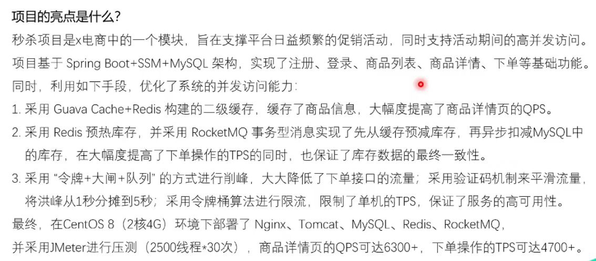

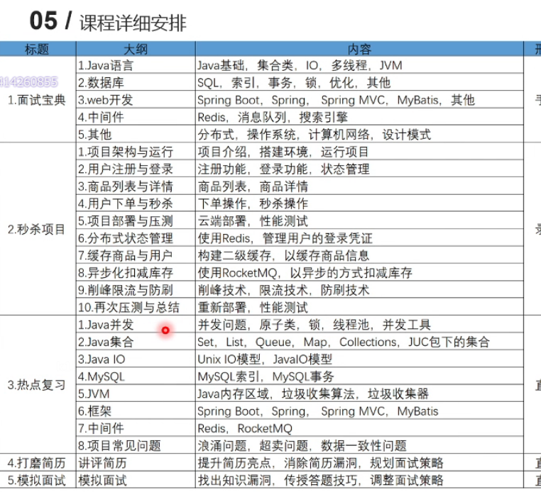

### 跨域Session共享问题

**跨域产生的条件**

- 使用xmlHttpRequest,即我们通常说的ajax请求

- 浏览器做了这个事

- 访问的域名不同，即访问的html页面是a域名下的，但内部js发送的ajax请求的目标地址却是b域名

以上三个条件缺一不可，尤其是第三个条件许多做移动端的同学可能都没有听过，因为移动端爽爽的用各种http请求狂发不同的域名，但是浏览器不允许我们这么做，为了一个词 安全

解决方法：

客户端：

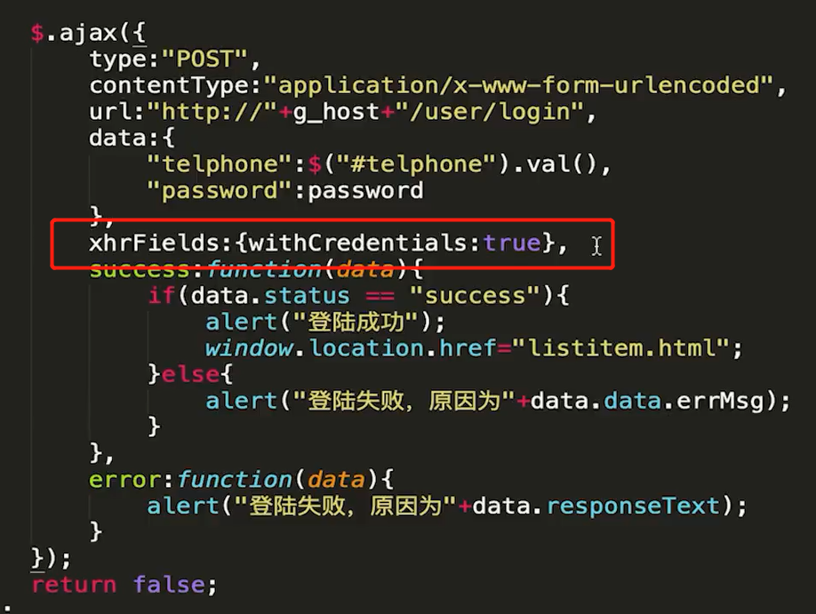

服务端：

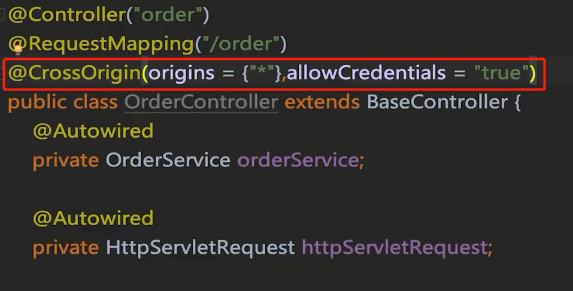

### Nginx反向代理

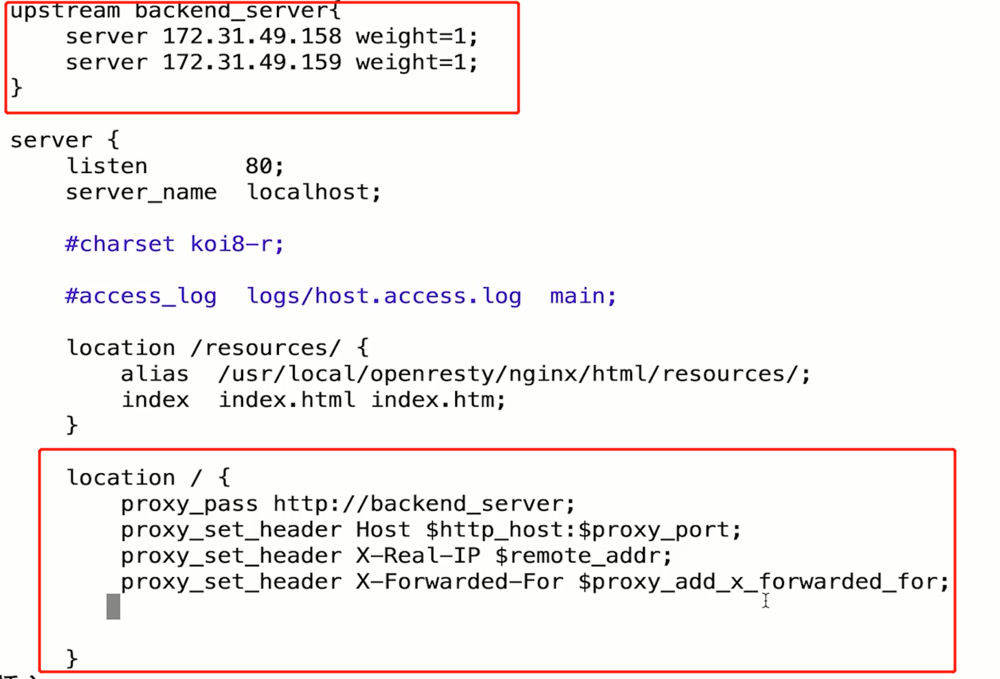

### RocketMQ

◆高性能，高并发，分布式消息中间件
◆典型应用场景：分布式事务，异步解耦

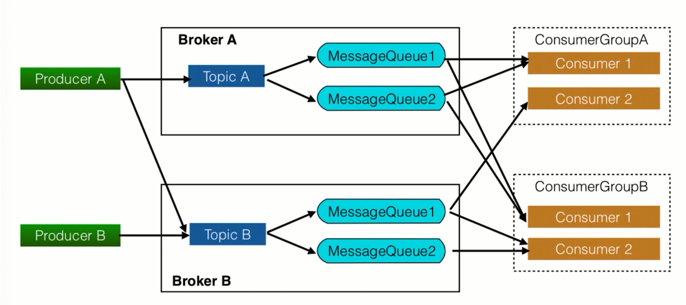

 

右侧是消费单体和消费组。

一个Topic可以被多个Broker管理。

MessageQueue 类似于ArrayBlockingQueue。

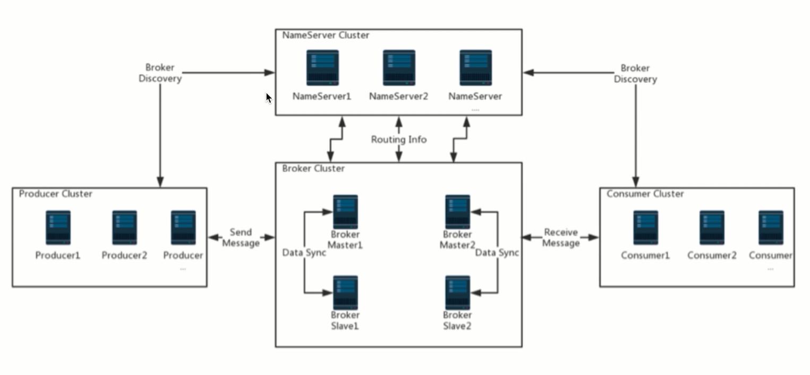

nameserber:类似于zookeeper一样，做服务发现使用。

broker、producer、consumer都需要去上面做注册。

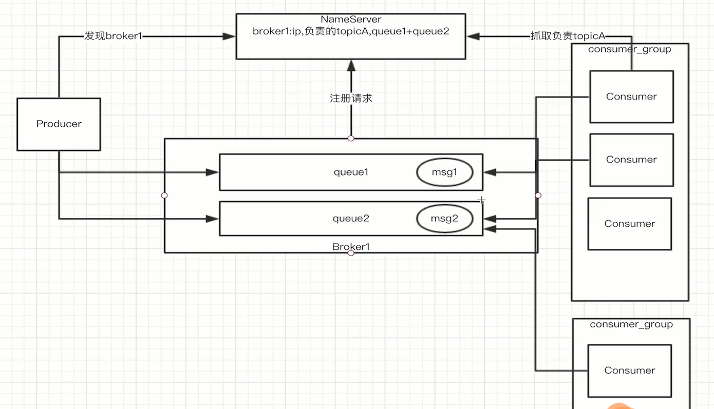

以consumer group为单位做消息的管理。Producer只负责发送消息，而不关心消息是被谁消费的。

consumer group1（订单系统）中只能有一个consumer可以消费msg1。

consumer group2（日志系统）也可以有一个consumer去消费msg1。

broker会在消息上做不同的标记。

主从复制：

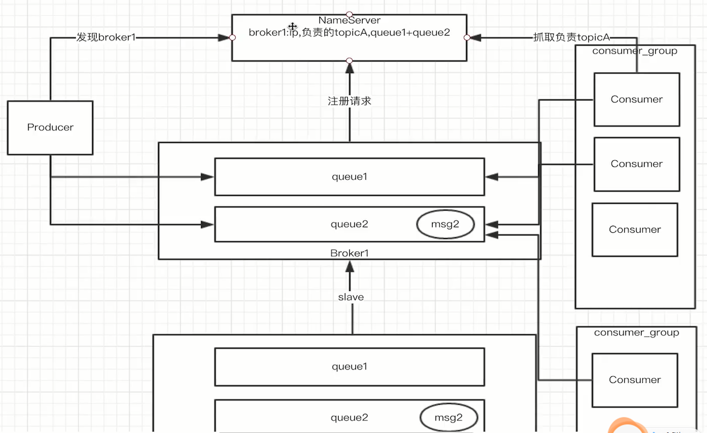

在broker1挂掉之后，nameserver会自动将slave竞选为主broker。并且通知所有的producer和consumer去broker2上进行操作。

主从之间可以分为 同步 和异步的同步方式。

设置consumer去订阅主题，当有消息时会自动调用该函数。真就是 观察者模式，也叫发布-订阅模式。

返回consumer_success即告诉消息队列，该消息被我消费了，不用再投放了。

### 分布式事务

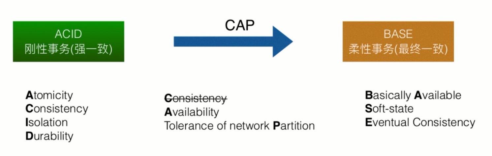

在本地Spring事务和MySql的事务支持下，可以达到强一致性。

但是在分布式环境下，却只能牺牲一部分的一致性，以获得高可用性和分区特性。我们不要求强一致性，但要求最终一致。

即 基本可用性、软状态（中间过程存在不一致状态）和最终一致性。

### 如何防止超卖？

1、利用数据库自带排他锁，当减库存的时候，进位where判断，只有库存余量大于0的时候才进行进库存; update goods set num = num - 1 WHERE id = 1001 and num > 0; 

2、也可以自己实现乐观锁CAS（(Compare and swap)版本号机制。select version from goods WHERE id= 1001；update goods set num = num - 1, version = version + 1 WHERE id= 1001 AND num > 0 AND version = @version(上面查到的version);

本项目：

在下单之前要获取 下单令牌，这个令牌是否数量限制的。但一般来说令牌数目都比库存要大，因为毕竟有的用户他最后不下单。

在redis中维护了，库存量。在获取令牌之前先对库存进行检查。

### **服务器抗压思路**

1. 生成订单前，进行一系列的检验：是否还有库存（redis标志位缓存），是否重复下单（表单中隐藏域id），这些数据都可以缓存。
2. 在商品活动开始前进行预热，将对应商品的库存预先缓存在redis中。这样相较每次去数据库扣减库存更迅速、高效。
3. 使用消息队列，异步去扣减数据库的库存；（异步生成订单实际上是 假异步化，用户还是得在页面上等待返回，前端轮询查询异步订单状态）

  ### **怎么保证redis缓存和数据库的一致性**

有三种经典的缓存使用模式：https://xie.infoq.cn/article/1322475e05c11bd2aacd8bc73

- Cache-Aside Pattern 旁路缓存模式

- Read-Through/Write-through 读写穿透模式 

- Write-behind 异步缓存写入 数据库作为最后面的记账管家

### 日常开发中，我们一般使用的就是 Cache-Aside 模式。有些小伙伴可能会问， Cache-Aside 在写入请求的时候，为什么是删除缓存而不是更新缓存呢？

延时双删；删除缓存重试机制；读取 biglog 异步删除缓存。

在更新数据库时，先删除缓存，再去更新数据库，延时1s后，在删除缓存。更新后再次删除的原因是，防止在更新过程中有别人查询了，且更新到了缓存，造成脏数据。延迟1s的原因是，为了确保读请求结束，写请求可以删除读请求可能带来的缓存脏数据。

### 秒杀项目中扣减库存过程

主要是采用了Write-behind模式，提前将库存加载进Redis中，使用Redis管理库存。在Redis扣减完库存后，再去异步更新数据库。而且采用事务型消息，将更新数据库、下订单合并在一个事务中，确保Redis和数据库的最终一致性。

事务型消息：transactionAsyncReduceStock，两段式提交。

先发送消息，但标记消息状态为prepared状态，不可被消费。

executeLocalTransaction：然后执行扣减库存、创建订单、更新redis的事务。一旦事务成功执行，则再次向MQ提交COMMIT_MESSAGE。否则，ROLLBACK_MESSAGE，对消息进行回滚。若长时间不响应结果，则checkLocalTransaction方法，检查事务执行状态，为了可以对事务进行跟踪，特别设置一个表stock_log。里面的状态位表示了此事务的状态。

### **前端设计**

​	**静态资源缓存：**将活动页面上的所有可以静态的元素全部静态化，尽量减少动态元素；通过CDN缓存静态资源，来抗峰值。在url后面加上？即可。应用服务器只接收处理动态请求。

​    **禁止重复提交**：前端:用户提交之后按钮置灰，禁止重复提交；后端：在进入页面时，服务器生成token并存到缓存或者session中，form表单使用隐藏域来存储这个token，提交之后带有token.后端收到这个token,看是否与服务器生成的token一致，如果不一致就是重复提交。如果一致，处理完之后清除token.

令牌，用过之后就在redis中删除此令牌

​    **用户限流：**某一时间段内只允许用户提交少数次请求，IP限流(Nginx设置IP地址限流

### **中间代理层：**

​    **利用负载均衡（例如反响代理Nginx等）使用多个服务器并发处理请求，减小服务器压力。**   

​    **(正向代理代理客户端VPN，反向代理代理服务器。NGINX)** 

​    横向增加服务器数量，然后将请求分发到各个服务器上，将原先请求集中到单个服务器上的情况改为将请求分发到多个服务器上，将负载分发到不同的服务器，也就是我们所说的负载均衡。普通轮询算法、比例加权轮询、ip路由负载、基于服务器响应时间负载分配、根据域名负载。

**轮询（默认）**：每个请求按时间顺序逐一分配到不同的后端服务器，如果后端服务器down掉，能自动剔除。

**指定权重**：指定轮询几率，weight和访问比率成正比，用于后端服务器性能不均的情况。

**IP绑定ip_hash**：每个请求按ip的hash结果分配，**这样每个访客固定访问一个后端服务器**，**可以解决session的问题。**

**url_hash**：按访问url的hash结果来分配请求，使每个url定向到同一个后端服务器，后端服务器为**缓存**时比较有效。

**fair**：按后端服务器的响应时间来分配请求，响应时间短的优先分配。

### **服务层：**

​    **业务分离**:将秒杀业务系统和其他业务分离，单独放在高配服务器上。

​    采**用消息队列缓存请求**：将大流量请求写到消息队列缓存，利用服务器根据自己的处理能力主动到消息缓存队列中抓取任务处理请求。

​    **利用缓存应对读请求**：对于读多写少业务，大部分请求是查询请求，所以可以读写分离，利用缓存分担数据库压力。

### **数据库层：**

​    上游就需要把请求拦截掉，数据库层只承担“能力范围内”的访问请求。所以，上面通过在服务层引入队列和缓存，让最底层的数据库高枕无忧。可以对数据库进行优化，减少数据库压力。

​    如果redis挂掉的话，如果提高数据库的并发能力：

​    **业务拆分**：将不同功能的模块拆分，使用不同的数据库。

​    MySQL**主从复制，读写分离**：

​    **分表分库：**

### **其他策略：**

**为请求分配成功状态或者分配秒杀资格，将没有资格的请求全部过滤，**只有有资格的才能参与秒杀。说到底的秒杀这个高并发，并不是真正的处理高并发请求，而是如何应对高并发。将大量请求拦截然后放小量请求到数据库执行抢单是完全可以的，不用担心请求丢失的问题。

### **消息队列**

​    **防止重复消费**：重复消费在消息队列所存在的问题中，从来都不是一个严重的问题。如果是消息是读，那多消费一次没啥影响。如果是写，例如我们这个订单生成，消费之前，查询一下是否之前已经存在用户ID商品ID构成的订单，我们可以将生成的订单存入缓存，所以查询一次也不费劲。

​    **消息的消费结果如何返回给消息发送方**：客户端轮询订单生成结果。

​    **消息丢失：**秒杀系统中，本来就是万中选一的，丢失无所谓。如果是重要的信息，我们可以从三个角度来避免。如果是**发送者丢失**，开启confirm机制，如果**队列丢失**，开始queue持久化和消息持久化。如果是**消费者丢失**，关闭自动ACK,当我们消费完之后，调用API给queue发送确认信息。

## 流量削峰

4000多QPS，

交易优化：缓存校验，异步扣减。

面临：浪涌流量。

本章目标
◆掌握秒杀令牌的原理和使用方式
◆掌握秒杀大闸的原理和使用方式
◆掌握队列泄洪的原理和使用方式

抛缺陷
◆秒杀下单接口会被脚本不停的刷
◆秒杀验证逻辑和秒杀下单接口强关联，代码冗余度高
◆秒杀验证逻辑复杂，对交易系统产生无关联负载

### 秒杀令牌原理
◆秒杀接口需要依靠令牌才能进入
◆秒杀的令牌由秒杀活动模块负责生成
◆秒杀活动模块对秒杀令牌生成全权处理，逻辑收口
◆秒杀下单前需要先获得秒杀令牌

以上将校验 与下单 进行了解耦。

缺陷：

令牌在活动开始后，可以无限生成，影响系统性能。

### 秒杀大闸原理
- 依靠秒杀令牌的授权原理定制化发牌逻辑，做到大闸功能

- 根据秒杀商品初始库存颁发对应数量令牌，控制大闸流量
- 用户风控策略前置到秒杀令牌发放中
- 库存售馨判断前置到秒杀令牌发放中

抛缺陷
◆浪涌流量涌入后系统无法应对
◆多库存，多商品等令牌限制能力弱

### 队列泄洪原理
- 排队有些时候比并发更高效（例如**redis单线程**模型，**innodb mutex key**等）

- 依靠排队去限制并发流量
- 依靠排队和下游拥塞窗口程度调整队列释放流量大小
- 支付宝银行网关队列举例，队列泄洪

实现：

采用固定大小的线程池，来执行下单逻辑，来保证同一时间只有20个线程在下单。

本地or分布式
◆本地：将队列维护在本地内存中
◆分布式：将队列设置到外部redis内（有网络请求消耗）

外部集中式的分布式队列，当外部出现故障时，切换回本地的队列。

## 防刷限流

本章目标
◆掌握验证码生成与验证技术
◆掌握限流原理与实现
◆掌握防黄牛技术

### 验证码技术

◆包装秒杀令牌前置，需要验证码来错峰
◆数学公式验证码生成器

 在controller中新增，generateverifycode接口：

1. 先验证用户登录状态

2. 返回验证码图片

3. 将验证码与userid绑定，存入redis中

   verify_code_uid ，设置exprie过期时间5min

在下单逻辑中，生成令牌之前，先验证 验证码。

### 限流目的
- 流量远比你想的要多
- 系统活着比挂了要好
- 宁愿只让少数人能用，也不要让所有人不能用 

### 限流方案：

1. 限制并发

   设置全局变量=100，每访问一个controller的入口时对此值减一。出口时+1。

   对于10s等长时间处理的请求，导致其与tps不对等

2. 令牌桶算法

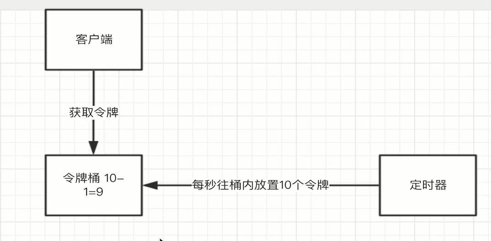

限制一秒内流量的最大值。（最常用）可以应对突发流量

3. 漏桶算法

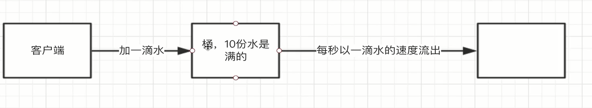

每秒钟流出10滴水，就是10tps

平滑网络流量，以固定的速率进行操作。

### 限流力度

1. 接口维度

   在接口维度引入令牌桶算法，限制tps

2. 总维度

   约是接口维度极限值总和的20%

### 限流范围

1. 集群限流

   需要依赖redis做统一计数器，该处往往产生性能瓶颈。

2. 单机限流

   在负载均衡的情况下，单机平均限流效果更好

### 限流实现

Guava RateLimiter

### 防刷
排队，限流，令牌均只能控制总流量，无法控制黄牛流量

传统防刷：

- 限制一个会话（session_id，token）同一秒钟/分钟接口调用多少次：多会话接入绕开无效

- 限制一个ip同一秒钟/分钟接口调用多少次：数量不好控制，容易误伤

  且更改ip头很容易

黄牛为什么难防：

- 模拟器作弊：模拟硬件设备，可修改设备信息
- 设备牧场作弊：工作室里一批移动设备
- 人工作弊：靠佣金吸引兼职人员刷单

设备指纹

- 采集终端设备各项参数，启动应用时生成唯一设备指纹（不完全靠谱，只是概率层面上）
- 根据对应设备指纹的参数猜测出模拟器等可疑设备概率

区分h5、APP、网页。

凭证系统：

- 根据设备指纹下发凭证
- 关键业务链路上带上凭证并由业务系统到凭证服务器上验证

- 凭证服务器根据对应凭证所等价的设备指纹参数并根据实时行为风控系统判定对应凭证的可疑度分数

- 若分数低于某个数值则由业务系统返回固定错误码，拉起前端验证码验身，验身成功后加入凭证服务器对应分数

不一定能防得住所有黄牛，但会增加黄牛的刷单代价，双方不断迭代的过程。

https protobuffe??加密？

APP的秘钥保存在哪里？内置的，不怕反编译？或者生成的？？
