### Maven

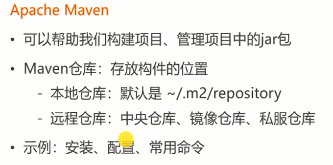

 

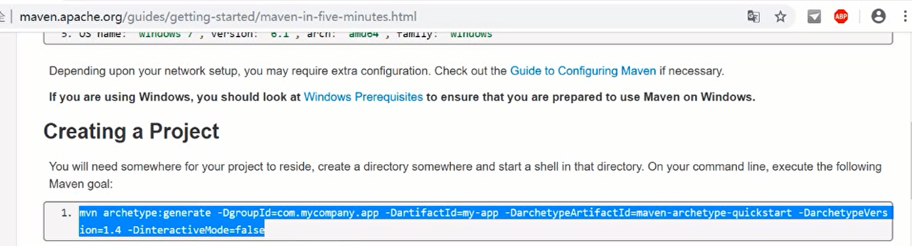

 编译项目： mvn compile

编译结果被放入 target/classes文件夹中(只编译了main下面写的)

清除之前的编译结果 mvn clean

先清理再编译 mvn clean compile

测试 mvn clean test  对test目录进行编译


  


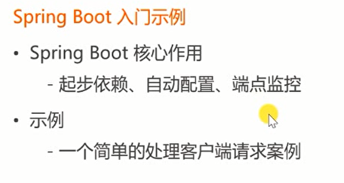

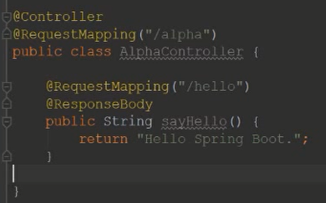


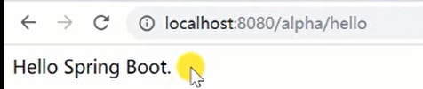

 

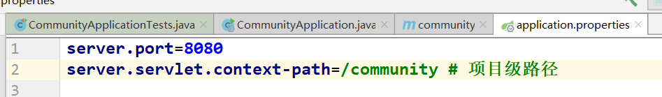

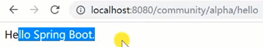

### Spring入门


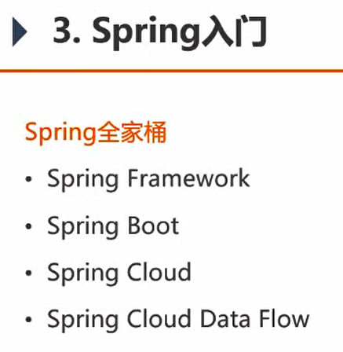

 

 https://Spring.io


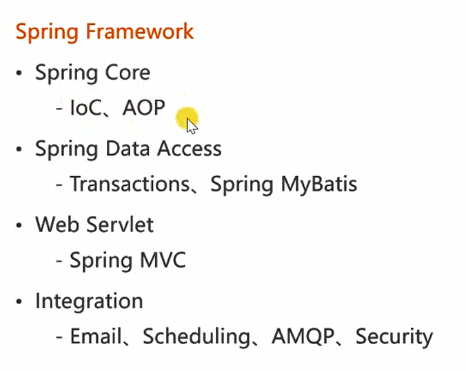

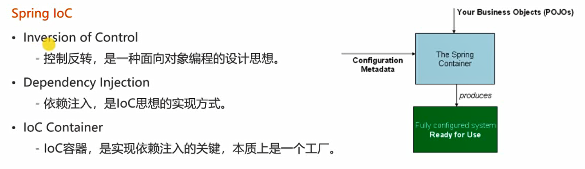

 

controller（处理请求）, service（业务）, repository（数据库访问） 都是由component实现的，都可以被扫描、自动装配的类。但有语义上的区别。


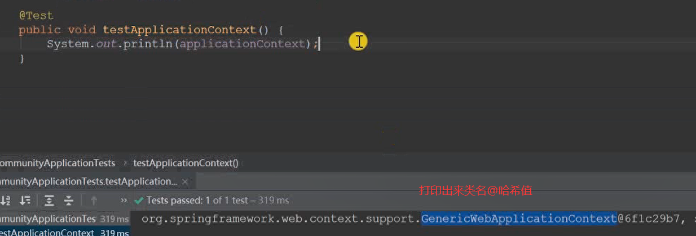


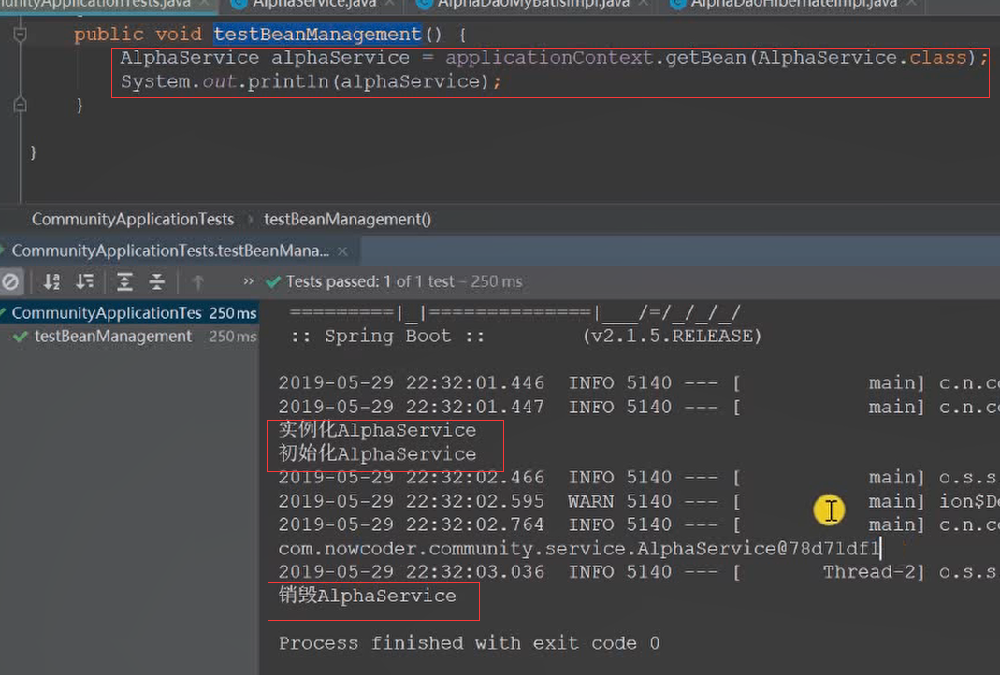

bean只被实例化一次，在程序关闭时才销毁。他是单例的！


也可以装配管理 第三方、非自己写的类。

需要自己设置配置类。


### SpringMVC入门

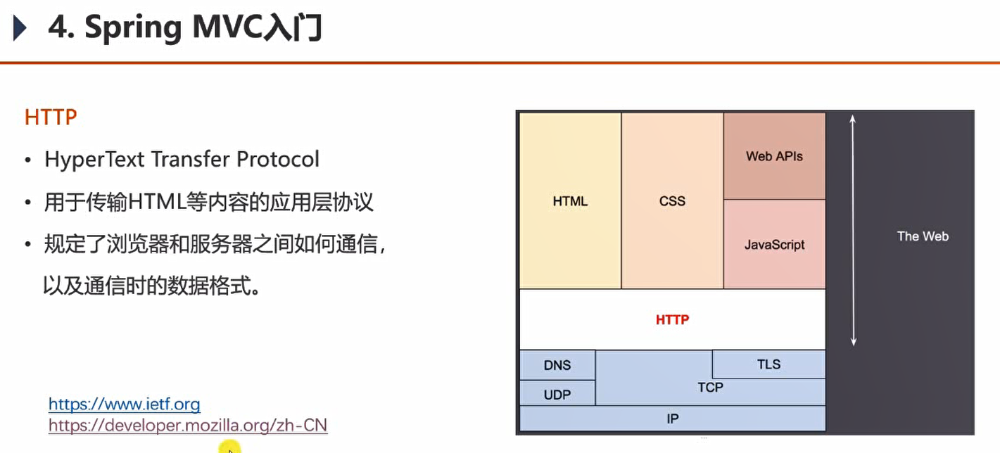

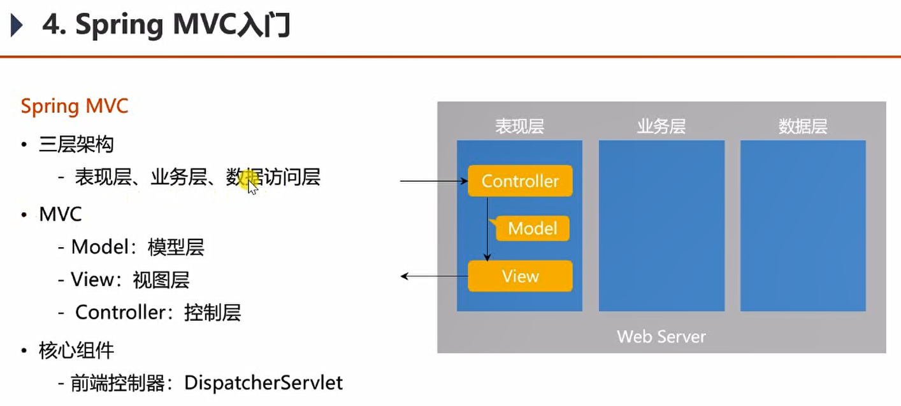

 controller将数据封装到model模型，传送给view去展示。

MVC三层是表现层中的三层。不同于服务器端的三层。Controller、Service、Repostroy

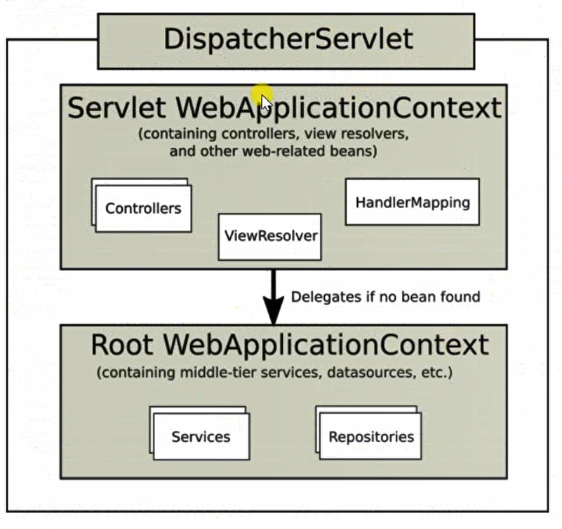

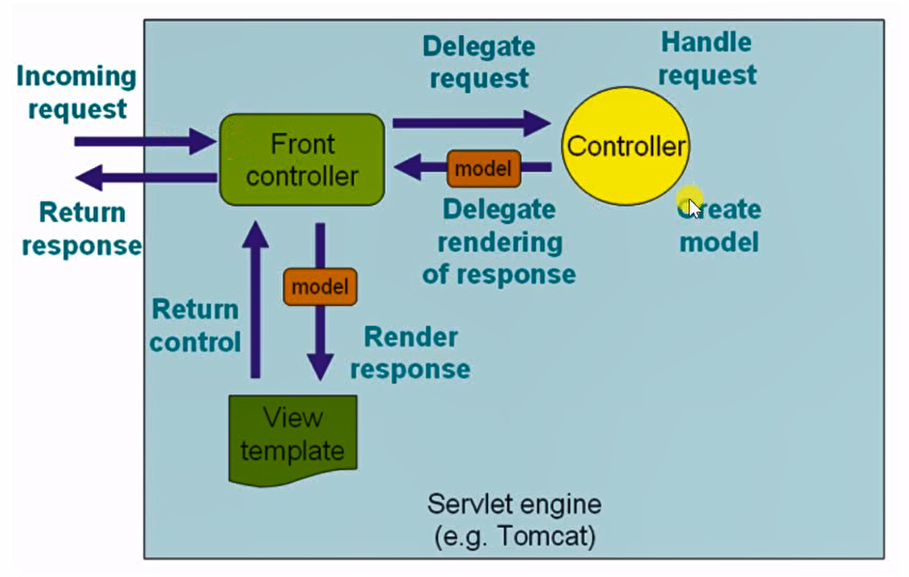

核心组件是DispatcherServlet，即上图中的Front Controller。

DispatcherServlet通过HandlerMapping，映射到具体的controller中的方法，controller调用Service完成逻辑处理，返回数据，将数据封装在Modeol中，DispatcherServlet再将Model中的数据传递给模板引擎，进行填充，然后再将html返回给请求方。


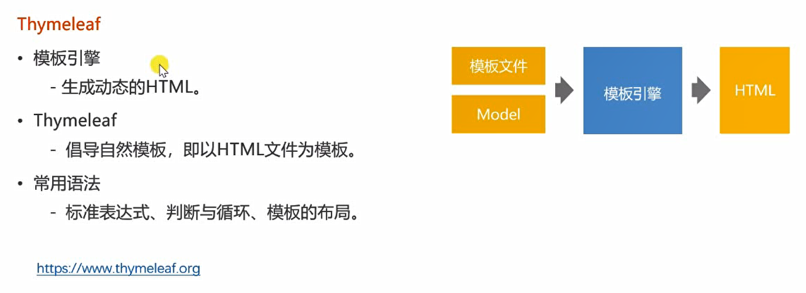

主要是如何利用controller对请求进行处理（获取请求中的参数的梁总方法）

进行相应，返回html数据（thymeleaf模板填充），返回JSON字符串。


### Mysql的安装

1. 配置 .ini文件

2. 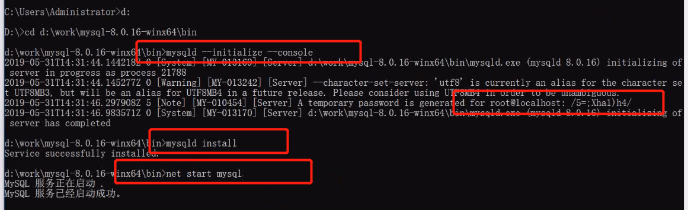

3. 登录，修改密码

   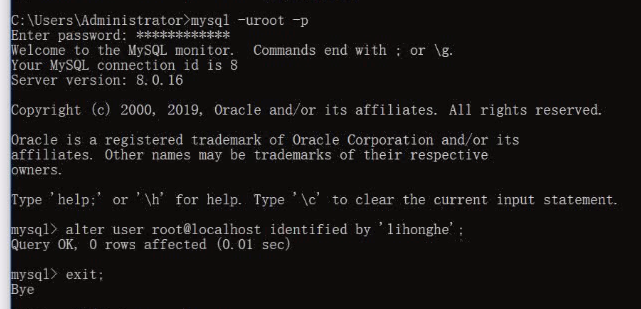


### MyBatis

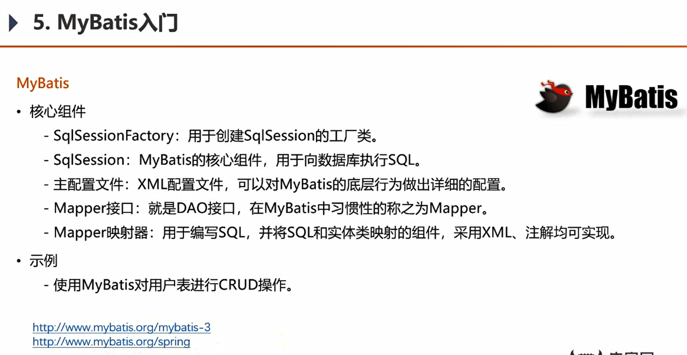


### 开发社区首页

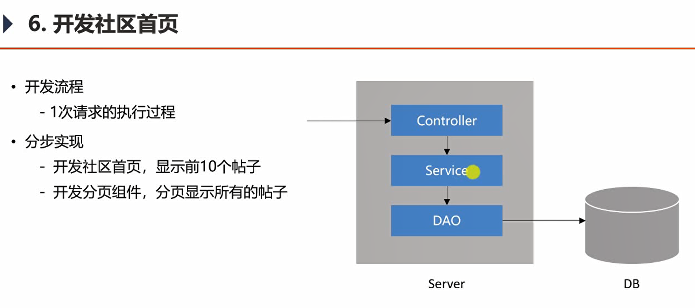

> 通过Url中的参数，传入?curr=3
>
> 而在controller中，用Page对象进行接收？是可以的吗？Page对象中有curr属性。


### 项目调试技巧

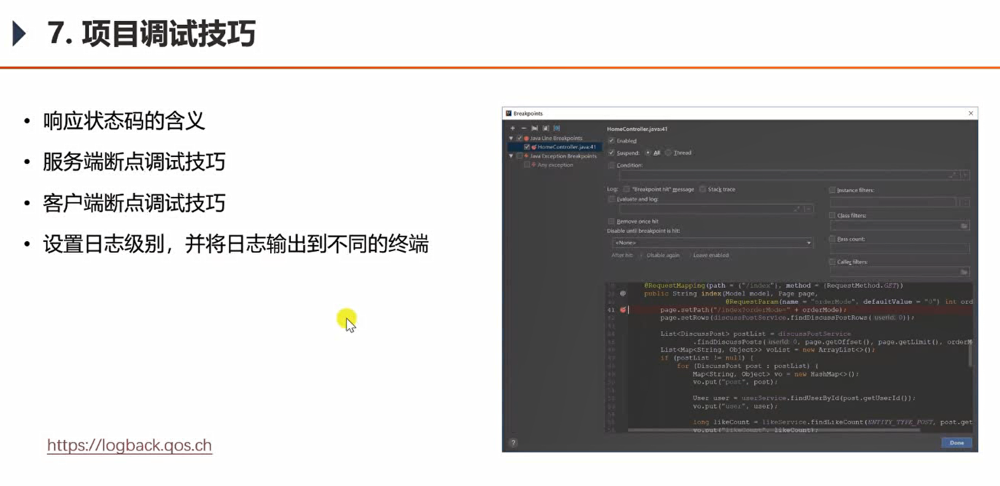

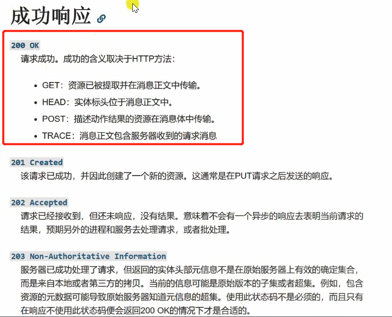

  

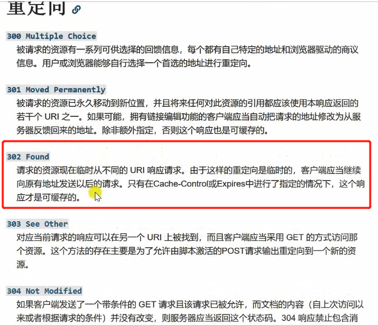


重定向：以低耦合的方式进行页面的跳转。

服务器端给出302 location跳转建议，让客户端自己去跳转。


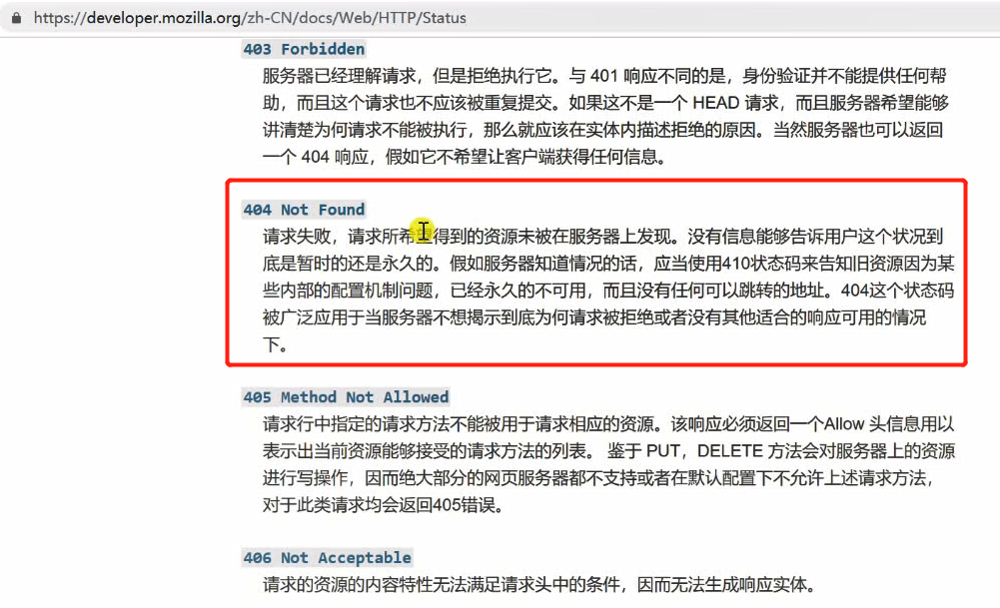

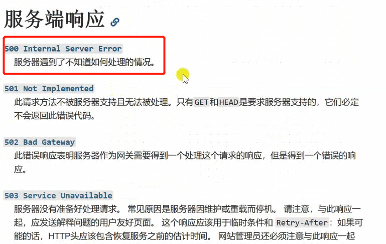

 

#### 日志工具logback

SpringBoot内置的日志工具。

### 版本控制

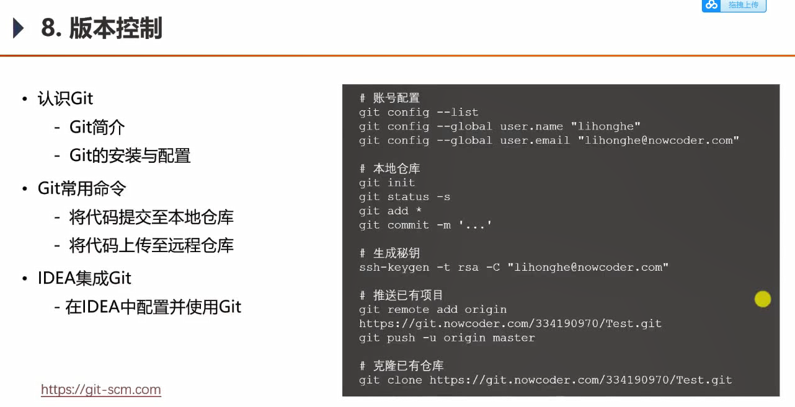

首次初始化，需要设置自己的邮箱与姓名，创建秘钥。


```
git init

git status //查看目录下是否有文件被修改

git add *

git commit -m 'first commit'
```

