### 过滤敏感词


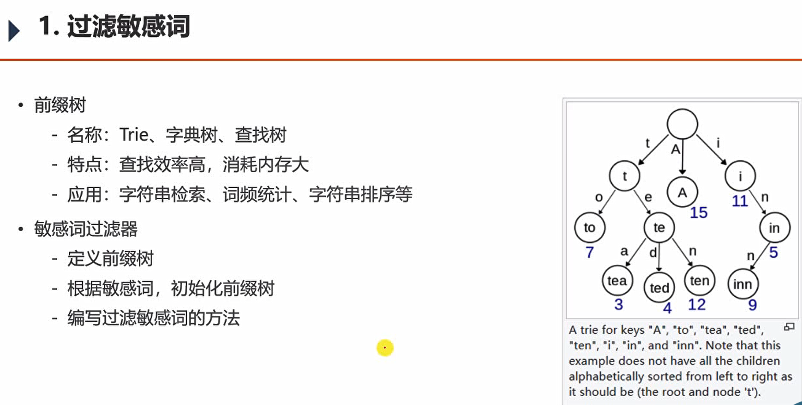

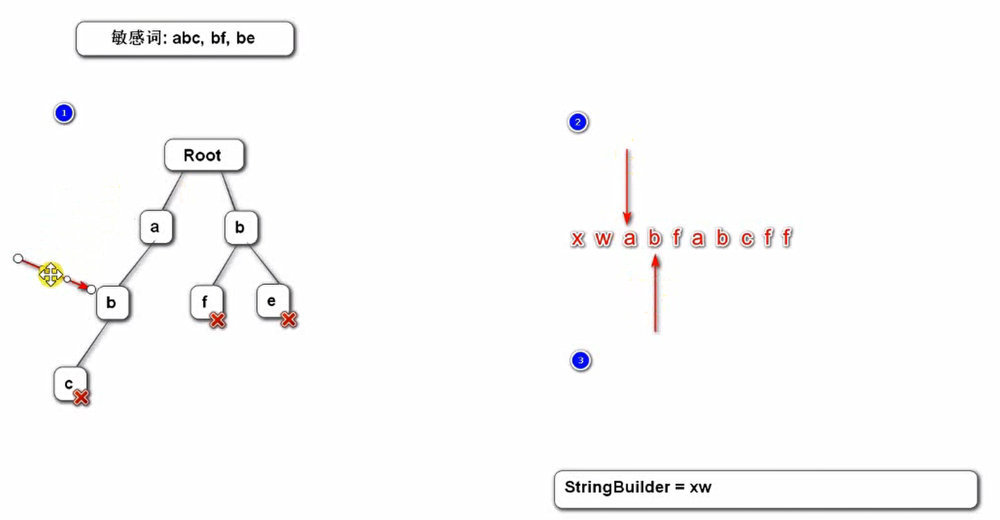


ctrl+f9手动编译。

@PostConstruct注解

在容器初始化该bean后，调用构造函数之后，调用该方法进行初始化

```java
InputStream is=this. getclass(). getclassLoader(). getResourceAsStream(name:"sensitive-words. txt");
//在类目录下获取文件
resource目录下的文件，在编译后会被放到classes目录下
```

完成 sensitiveFilter.filter(string s)用于过滤敏感词 

### 发布帖子

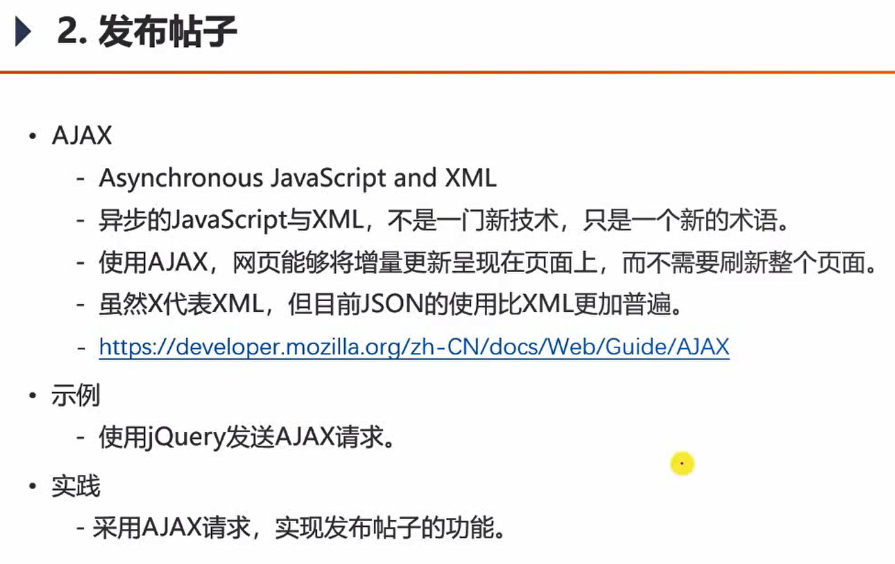

- 异步请求

- jQuery实现AJAX的通用写法

```js
<p>
        <input type="button" value="发送" onclick="send();">
    </p>

    <script src="https://code.jquery.com/jquery-3.3.1.min.js" crossorigin="anonymous"></script>
    <script>
        function send() {
            $.post(
                "/community/alpha/ajax",//访问路径
                {"name":"张三","age":23},//发送的数据
                function(data) {//匿名的回调函数
                    console.log(typeof(data));
                    console.log(data);

                    data = $.parseJSON(data);//转换为json
                    console.log(typeof(data));
                    console.log(data.code);
                    console.log(data.msg);
                }
            );
        }
    </script>
```


### 帖子详情

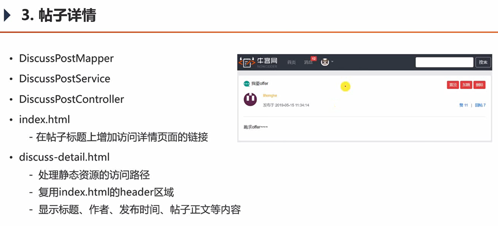

```
th:utext 可以解析html
```


### 事务管理

回顾

- 什么是事务
  -事务是由N步数据库操作序列组成的逻辑执行单元，这系列操作**要么全执行，要么全放弃执行**。

- **事务的特性（ACID）**
- 原子性（Atomicity）：事务是应用中不可再分的**最小执行体**。
  - 一致性（Consistency）：事务执行的结果，须使数据从一个**一致性状态**，变为另一个一致性状态
  
- **隔离性（Isolation）**：各个事务的执行互不干扰，任何事务的内部操作对其他的事务都是隔离的。
  - 持久性（Durability）：事务一旦提交，对数据所做的任何改变都要记录到**永久存储器**中。


事务的隔离性：

服务器程序：多线程环境（每一个访问是一个线程），多事务并发的场景。

存在多个事务访问同一条数据的情况。

- 常见的并发异常
  - 第一类丢失更新、第二类丢失更新。
  - 脏读、不可重复读、幻读。
- 常见的**隔离级别**
  - Read Uncommitted：读取未提交的数据。
  - Read Committed：读取已提交的数据。
  - Repeatable Read：可重复读。
  - Serializable：串行化。


- 第一类丢失更新
  某一个事务的回滚，导致另外一个事务已更新的数据丢失了。

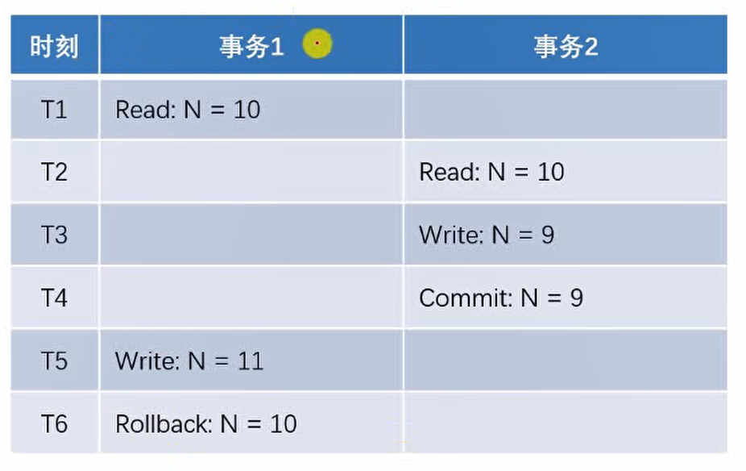

- 第二类丢失更新
  某一个事务的提交，导致另外一个事务已更新的数据丢失了。

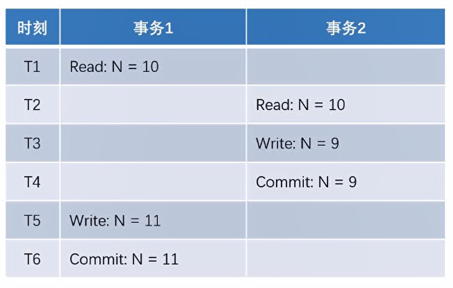

- 脏读
  某一个事务，读取了另外一个事务未提交的数据。

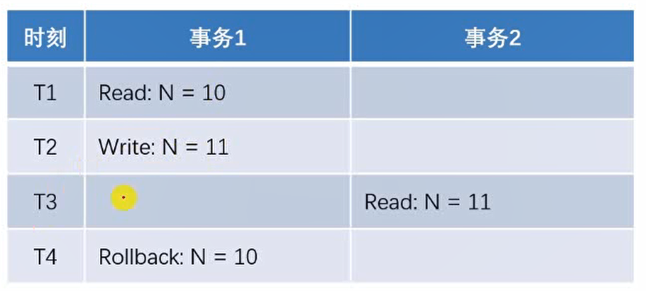

- 不可重复读
  某一个事务，对同一个数据前后读取的结果不一致。

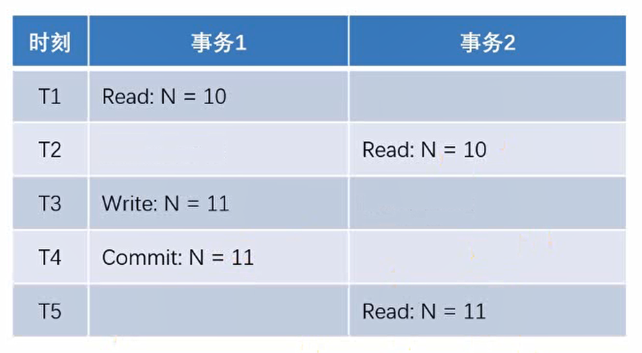

- 幻读
  某一个事务，对同一个表前后查询到的行数不一致。

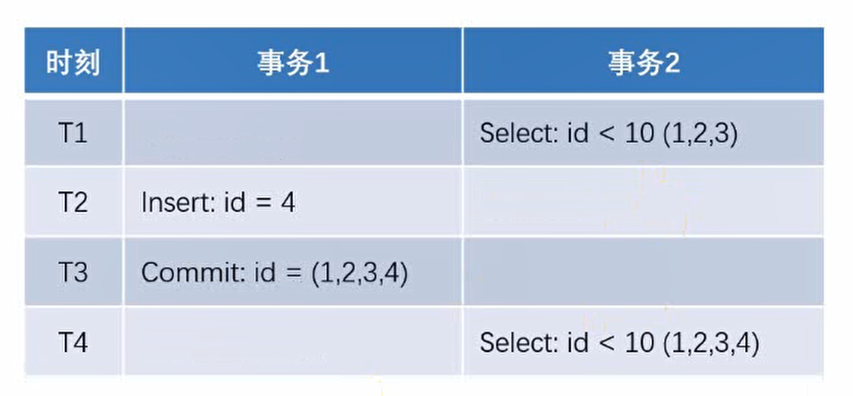

事务隔离级别：

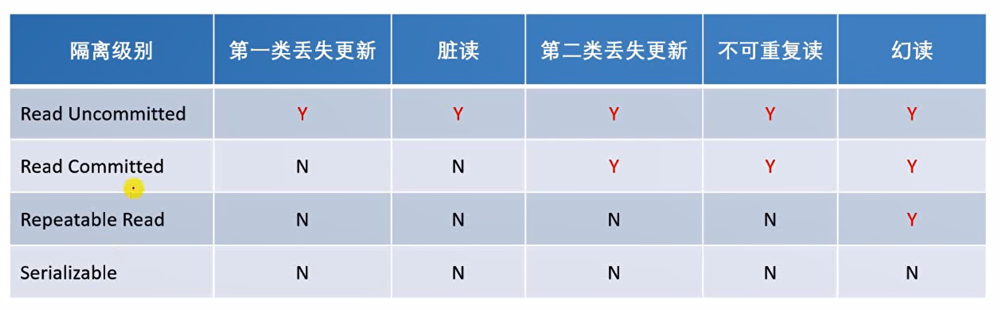

互联网开发主要是：

Read Committed：

Repeatable Read：可能出现幻读，影响行数的统计。可以进行业务规避，比如在后半夜进行统计。


实现机制

- 悲观锁（数据库）：看待问题很悲观，认为只要并发一定会出现问题。
  - 共享锁（S锁）事务A对某数据加了共享锁后，其他事务只能对该数据加共享锁，但不能加排他锁。（可读，不可更改）
  - 排他锁（X锁）事务A对某数据加了排他锁后，其他事务对该数据既不能加共享锁，也不能加排他锁。
- 乐观锁（自定义）：认为即便并发，也通常不会出现问题。该读读、该改改，在完成操作后检查版本号，版本号无异常就提交。
  - 版本号、时间戳等（给表多加一个字段）
    在更新数据前，检查版本号是否发生变化。若变化则取消本次更新，否则就更新数据（版本号+1）。


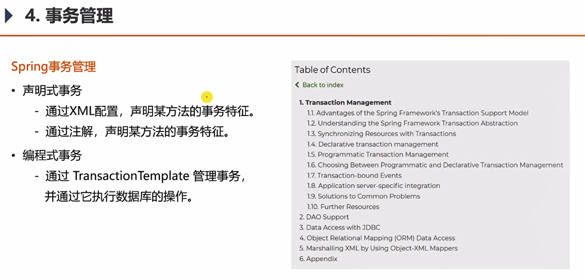

Spring事务管理

- 声明式事务
  - 通过XML配置，声明某方法的事务特征。
  - 通过注解，声明某方法的事务特征。
- 编程式事务
  - 通过Transaction Template管理事务，并通过它执行数据库的操作。【更细粒度】


**应用：**

> 在添加评论的同时，增加了评论数量。

```java
@Transactional(isolation = Isolation.READ_COMMITTED, propagation = Propagation.REQUIRED)
```

**事务的传播机制：**

- PROPAGATION_REQUIRED (默认)

  - 支持当前事务，如果当前没有事务，则新建事务如果当前存在事务，则加入当前事务，合并成一个事务

  REQUIRES_NEW新建事务，如果当前存在事务，则把当前事务挂起这个方法会独立提交事务，不受调用者的事务影响，父级异常，它也是正常提交


 ### 显示评论

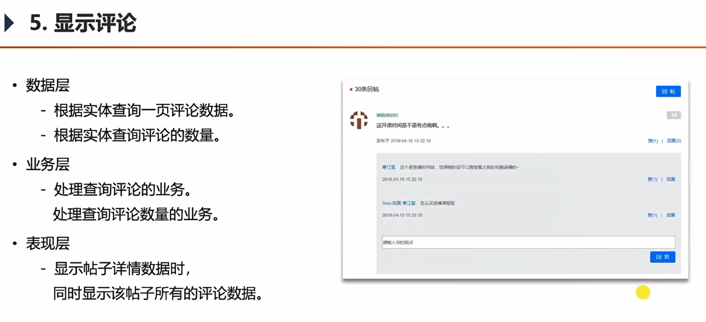

> 一套业务解决所有的评论问题。对帖子的评论，对评论的评论、对课程的评论等。

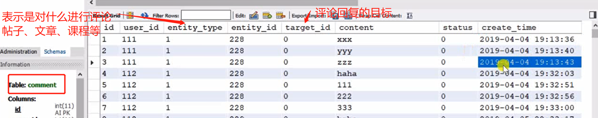


### 添加评论

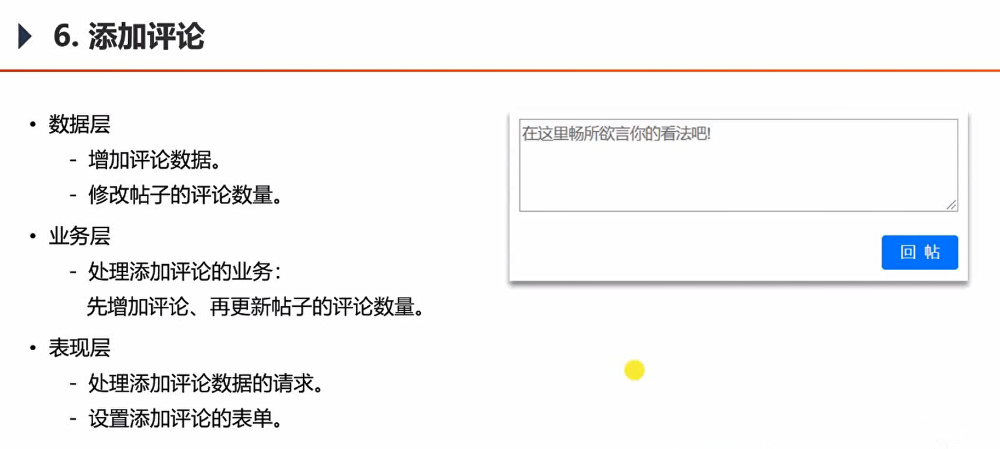


### 私信列表

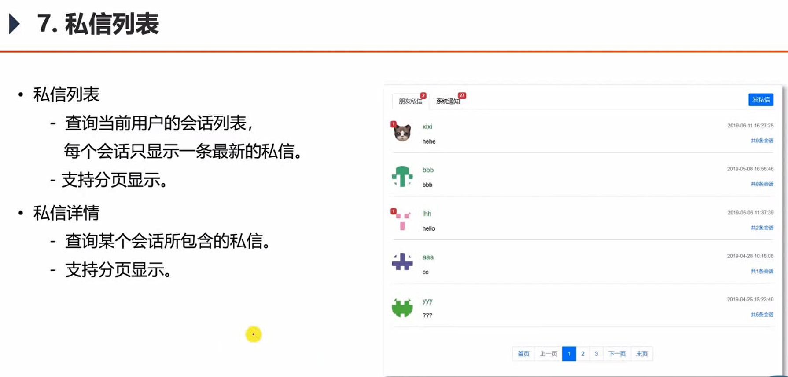


### 发送私信

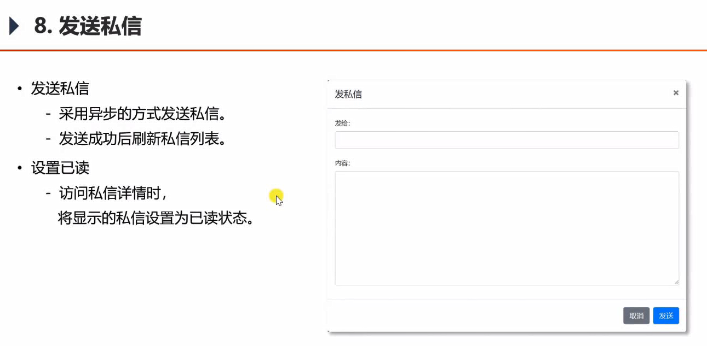

### 统一异常处理

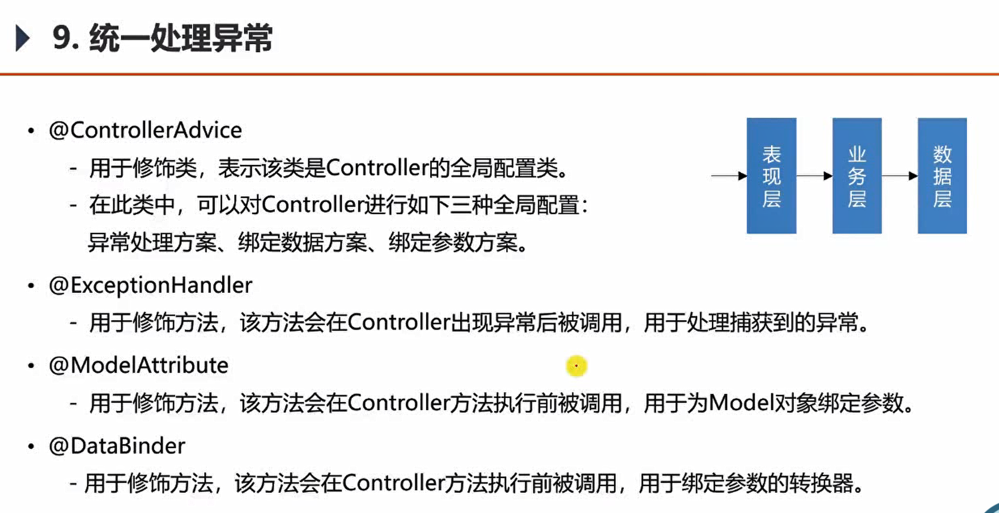

表现层是调用者，最顶层。

因此，在表现层处统一处理异常。


#### SpringBoot的默认异常处理：

按照以下路径放置错误页面即可生效。

  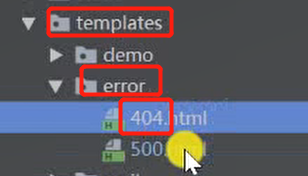


即便是错误，也要给用户返回一个清晰直观、友好的提示。

#### Spring的异常处理：

在Controller中捕获错误信息，记录日志，然后向前台返回错误信息。

区分是普通请求，还是json的那种异步请求。


- @ControllerAdvice 
  - 用于修饰类，表示该类是Controller的全局配置类。
  - 在此类中，可以对Controller进行如下三种全局配置：
    - 异常处理方案、绑定数据方案、绑定参数方案。


- @ExceptionHandler
  -用于修饰方法，该方法会在Controller出现异常后被调用，用于**处理捕获到的异常**。

- @ModelAttribute
  -用于修饰方法，该方法会在Controller方法执行前被调用，用于为Model对象绑定参数。

  作用：**给Model绑定统一的参数**

- @DataBinder
  -用于修饰方法，该方法会在Controller方法执行前被调用，用于绑定参数的转换器。

  在客户端向服务器传数据的时候，可以自动的**将数据转换为对象**。是因为有转换器。

  但要是特殊的数据，没有内置的自带的转换器。可以手动使用DataBinder注册转换器。


### 统一记录日志

不发生异常也要记录日志。

统一异常处理，是针对异常的情况进行 处理与记录日志。

拦截器，是针对控制器的处理。

可能针对业务组件或者数据访问层进行记录日志。

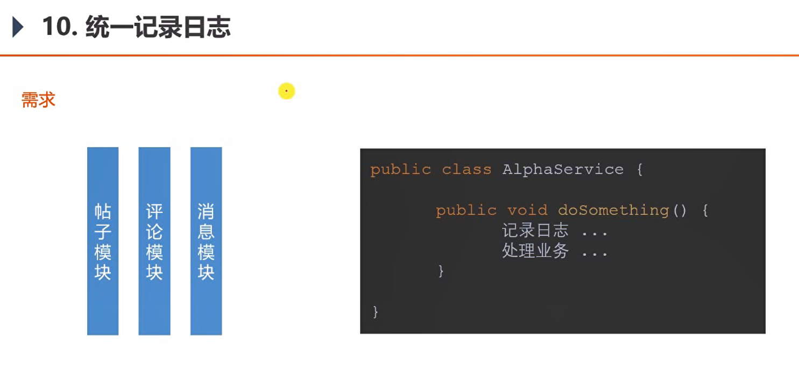

需求：对所有的Service记录日志。

传统方法：将日志记录封装到组件中，然后在不同的Service中去进行调用。

弊端：业务组件Service，主要目的是处理业务。而记录日志是**系统需求**，不应该放在Service中处理。导致在业务方法中 系统需求与业务需求 耦合了。一旦系统日志需求，发生变化，会造成大幅改动。


#### 单独实现日志记录：AOP技术

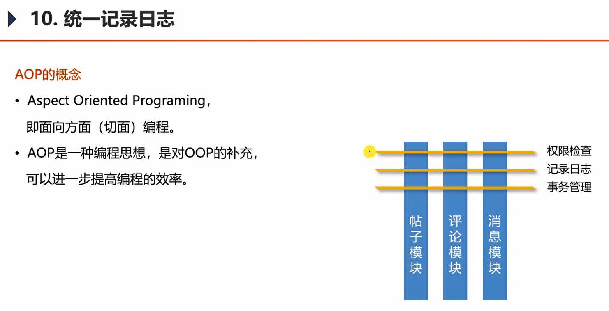

额外定义一个系统组件。

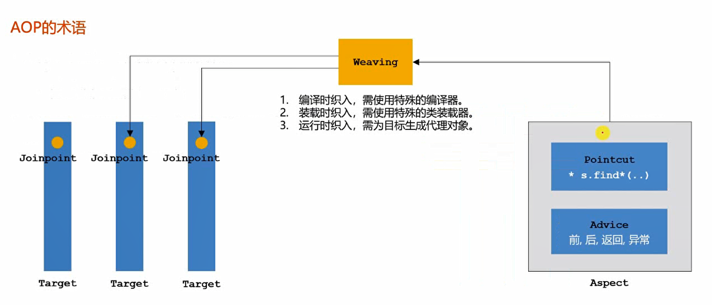

Target：目标对象，已经开发好的业务处理模型。

Joinpoint: 连接点，可以被织入 的地方

Aspect：切面。AOP中的核心处理代码组件。 有三种方式可以织入到连接点处。

1.编译时织入，需使用特殊的编译器。
2.装载时织入，需使用特殊的类装载器。
3.运行时织入，需为目标生成代理对象。最灵活，可以获得运行时才有的一些信息。但效率较差。

Weaving：织入

Pointcut：切点。切面组件通过切点声明，要织入到哪些对象的哪些位置。

Advice：通知。声明 切面组件的具体处理逻辑。是在方法前还是后，还是返回处，还是异常发生处。


#### AOP的实现
- AspectJ
  - AspectJ是语言级的实现（**新的语言**，所以在用的时候要学这个新语言），它扩展了Java语言，定义了AOP语法。
  - AspectJ在编译期织入代码，它有一个专门的编译器，用来生成遵守Java字节码规范的class文件。
  - 功能强大，支持所有的连接点。
- Spring AOP
  - Spring AOP使用**纯Java实现**，它不需要专门的编译过程，也不需要特殊的类装载器。
  - Spring AOP在**运行时通过代理的方式织入代码**，**只支持方法类型的连接点**。
  - Spring支持对AspectJ的集成。
  - 性价比最高的解决方案。


代理：即通过代理对象去调用原对象的方法。

- JDK动态代理
  - Java提供的动态代理技术，可以在**运行时**创建接口的代理实例。（在代理时自动生成接口的实现类，代替原有的实现类）
  - Spring AOP默认采用此种方式，**在接口的代理实例中织入代码**。

- CGLib动态代理
  - 采用底层的字节码技术，在**运行时**创建**子类**（继承）代理实例。（适用于没有接口的情况，创建目标对象的子类，当做代理实例）
  - 当目标对象不存在接口时，Spring AOP会采用此种方式，在**子类实例**中织入代码。
  - 第三方技术


```java
@Component
@Aspect
public class ServiceLogAspect {

    private static final Logger logger = LoggerFactory.getLogger(ServiceLogAspect.class);

    @Pointcut("execution(* com.nowcoder.community.service.*.*(..))")
    public void pointcut() {

    }

    @Before("pointcut()")
    public void before(JoinPoint joinPoint) {
        // 用户[1.2.3.4],在[xxx],访问了[com.nowcoder.community.service.xxx()].
        //用于获得request对象
        ServletRequestAttributes attributes = (ServletRequestAttributes) RequestContextHolder.getRequestAttributes();
        HttpServletRequest request = attributes.getRequest();
        String ip = request.getRemoteHost();
        String now = new SimpleDateFormat("yyyy-MM-dd HH:mm:ss").format(new Date());
        String target = joinPoint.getSignature().getDeclaringTypeName() + "." + joinPoint.getSignature().getName();
        logger.info(String.format("用户[%s],在[%s],访问了[%s].", ip, now, target));
    }

}
```

AOP的应用场景：

权限检查、日志记录、事务管理