### 发送邮件

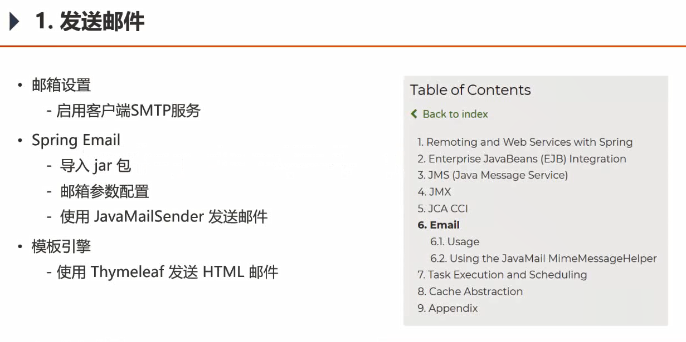

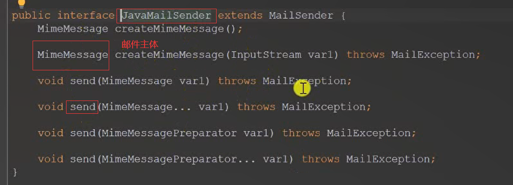

 *MIME*(Multipurpose Internet Mail Extensions)多用途互联网邮件扩展类型 


### 开发注册功能

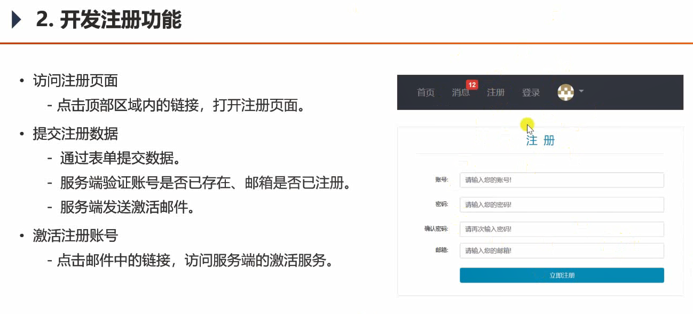


- header的复用
- common-lang
- ctrl+F9 编译快捷键

### 会话管理

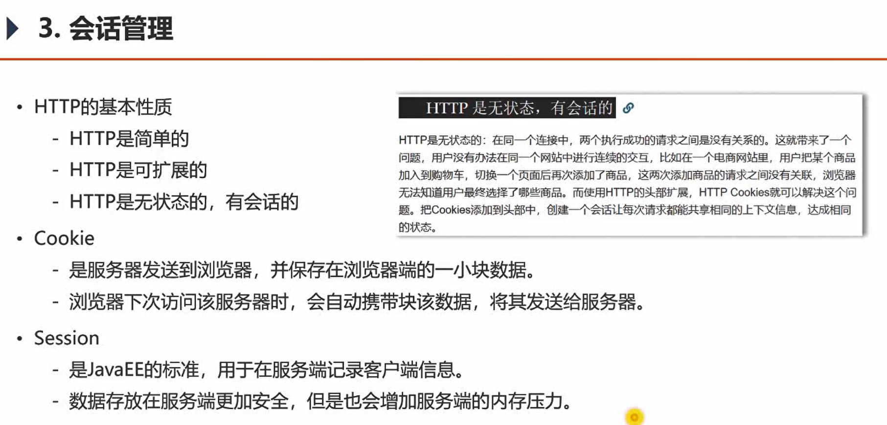

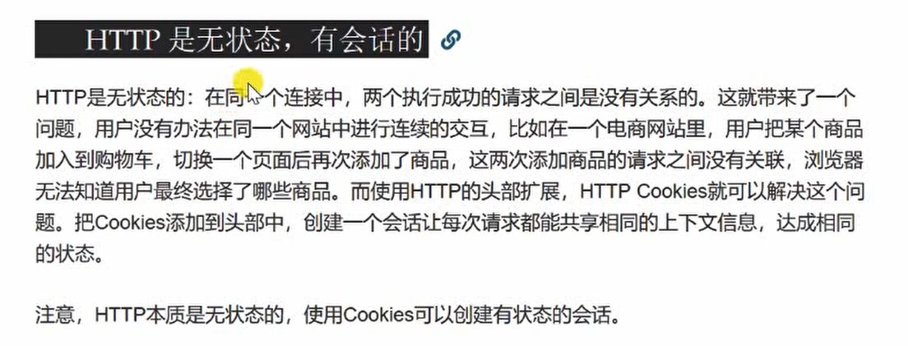

HTTP是无状态的：在同个连接中，两个执行成功的请求之间是没有关系的。这就带来了一个问题，用户没有办法在同一个网站中进行连续的交互，比如在一个电商网站里，用户把某个商品加入到购物车，切换一个页面后再次添加了商品，这两次添加商品的请求之间没有关联，浏览器无法知道用户最终选择了哪些商品。而使用HTTP的头部扩展，HTTP Cookies就可以解决这个问题。把Cookies添加到头部中，创建一个会话让每次请求都能共享相同的上下文信息，达成相同的状态。
注意，HTTP本质是无状态的，使用Cookies可以创建有状态的会话。

https://developer.mozilla.org/zh-CN/docs/Web/HTTP/Overview#HTTP_的基本性质  

HTTP Cookie（也叫Web Cookie或浏览器Cookie）是服务器发送到用户浏览器并**保存在本地的一小块数据**，它会在浏览器下次向同一服务器再发起请求时被携带并发送到服务器上。通常，它用于告知服务端两个请求是否来自同一浏览器，如保持用户的登录状态。Cookie使基于无状态的HTTP协议记录稳定的状态信息成为了可能。心
Cookie主要用于以下三个方面：

- 会话状态管理（如用户登录状态、购物车、游戏分数或其它需要记录的信息）

- 个性化设置（如用户自定义设置、主题等）

- 浏览器行为跟踪（如跟踪分析用户行为等）

  Cookie曾一度用于客户端数据的存储，因当时并没有其它合适的存储办法而作为唯一的存储手段，但现在随着现代浏览器开始支持各种各样的存储方式，Cookie渐渐被淘汰。由于服务器指定Cookie后，浏览器的每次请求都会携带Cookie数据，会带来额外的性能开销（尤其是在移动环境下）。新的浏览器API已经允许开发者直接将数据存储到本地，如使用Web storage API（本地存储和会话存储）或IndexedDB。

```java
// cookie示例

    @RequestMapping(path = "/cookie/set", method = RequestMethod.GET)
    @ResponseBody
    public String setCookie(HttpServletResponse response) {
        // 创建cookie
        Cookie cookie = new Cookie("code", CommunityUtil.generateUUID());
        // 设置cookie生效的范围
        cookie.setPath("/community/alpha");//仅在此范围内会带上cookie发送给服务器
        // 设置cookie的生存时间
        cookie.setMaxAge(60 * 10);若不设置生存时间，在浏览器关闭后即删除了
        // 发送cookie
        response.addCookie(cookie);

        return "set cookie";
    }

    @RequestMapping(path = "/cookie/get", method = RequestMethod.GET)
    @ResponseBody
    public String getCookie(@CookieValue("code") String code) {
        System.out.println(code);
        return "get cookie";
    }
```

- 不够安全
- 每次都把cookie发给服务器，会对网络性能产生影响


Session

- 是JavaEE的标准，用于在服务端记录客户端信息。
- 数据存放在服务端**更加安全**，但是也会增加服务端的**内存压力**。
- 可存比较隐私的数据。
- 本质上依赖于Cookie，来映射用户和Session。

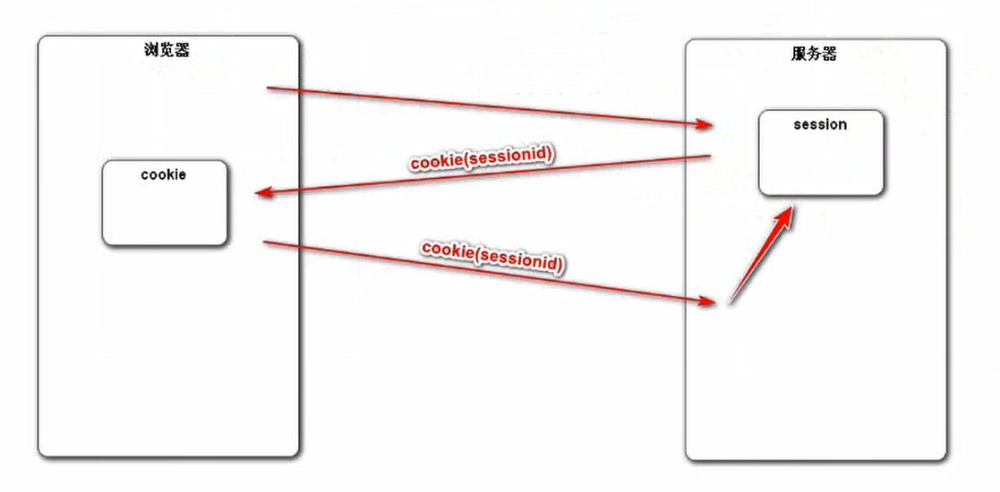

使用演示：

```java
session和 request/response/model一样，由SpringMVC自动创建，并注入
只需要在函数的传入参数中声明，即可被自动注入
// session示例

    @RequestMapping(path = "/session/set", method = RequestMethod.GET)
    @ResponseBody
    public String setSession(HttpSession session) {
        session.setAttribute("id", 1);
        session.setAttribute("name", "Test");
        return "set session";
    }

    @RequestMapping(path = "/session/get", method = RequestMethod.GET)
    @ResponseBody
    public String getSession(HttpSession session) {
        System.out.println(session.getAttribute("id"));
        System.out.println(session.getAttribute("name"));
        return "get session";
    }
```

- 单体应用可用；分布式部署会出现问题；

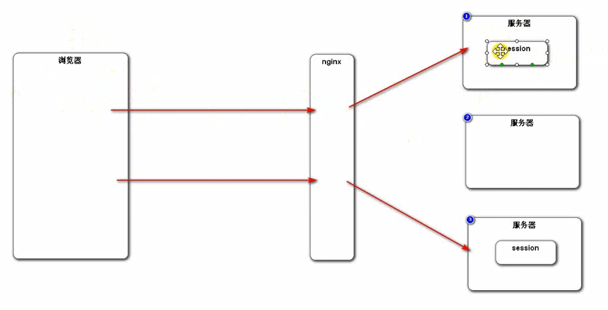

处理方式：

- 粘性会话：但负载并不一定均衡
- 同步session，每个服务器内存中都存所有session数据
  - 服务器之间耦合
- 共享Session：单独一台服务器存session
  - 单体Session是瓶颈
- 主流方法：
  - 不用Session，只用cookie
  - 对应的数据存在数据库集群（Redis)当中


### 生成验证码

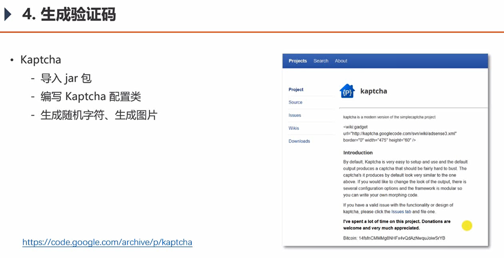

maven导入

```java
<dependency>
			<groupId>com.github.penggle</groupId>
			<artifactId>kaptcha</artifactId>
			<version>2.3.2</version>
</dependency>
```


```java
package com.nowcoder.community.config;

@Configuration
public class KaptchaConfig {

    @Bean
    public Producer kaptchaProducer() {
        Properties properties = new Properties();
        properties.setProperty("kaptcha.image.width", "100");
        properties.setProperty("kaptcha.image.height", "40");
        properties.setProperty("kaptcha.textproducer.font.size", "32");
        properties.setProperty("kaptcha.textproducer.font.color", "0,0,0");
        properties.setProperty("kaptcha.textproducer.char.string", "0123456789ABCDEFGHIJKLMNOPQRSTUVWXYAZ");//生成的范围
        properties.setProperty("kaptcha.textproducer.char.length", "4");//生成的长度
        properties.setProperty("kaptcha.noise.impl", "com.google.code.kaptcha.impl.NoNoise");//采用哪个干扰类

        DefaultKaptcha kaptcha = new DefaultKaptcha();
        Config config = new Config(properties);
        kaptcha.setConfig(config);
        return kaptcha;
    }

}
```

在页面上添加：

```html
<div class="col-sm-4">
							
							<a href="javascript:refresh_kaptcha();" class="font-size-12 align-bottom">刷新验证码</a>
						</div>
```

```js
	<script>
		function refresh_kaptcha() {
			var path = CONTEXT_PATH + "/kaptcha?p=" + Math.random();用新的参数保证浏览器会去重新请求，而不是用缓存
			$("#kaptcha").attr("src", path);取id为kaptcha的元素，更换其属性src为新的路径
		}
	</script>
```

### 开发登录、退出功能

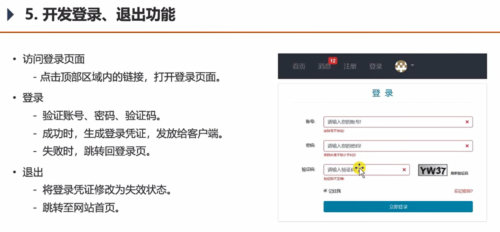

themleaf中的一些小用法：

```
@{/css/global.css}  @{} 是访问链接 自动包含了项目前缀名
```

```html
<div class="form-group row">
	<label for="username" class="col-sm-2 col-form-label text-right">账号:</label>
	<div class="col-sm-10">
	<input type="text" th:class="|form-control ${usernameMsg!=null?'is-invalid':''}|"
th:value="${param.username}" id="username" name="username" placeholder="请输入您的账号!" required>
	<div class="invalid-feedback" th:text="${usernameMsg}">该账号不存在!</div>
	</div>
	</div>
```

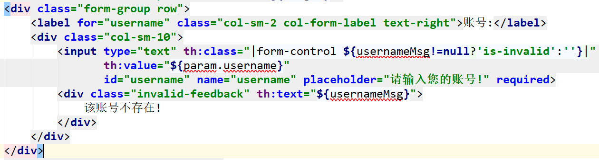

根据错误信息usernameMsg的信息，来决定是否拼接上 is-invalid 项。

当 is-invalid 存在时，invalid-feedback的信息才会显示出来。

`th:value="${param.username}"`是从request中取参数。

### 显示登录信息

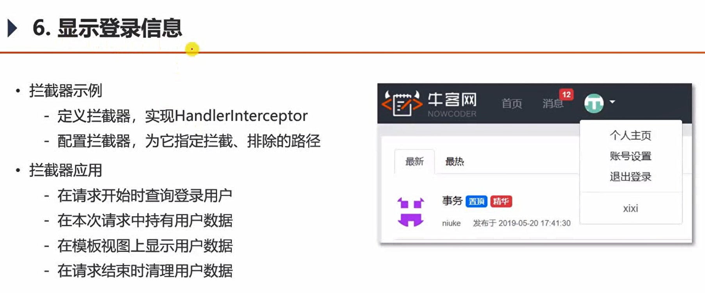

做一个登录与否的检查，即便是封装好了，每个controller去调用，也需要调用很多次。【侵入性、耦合度太高了】===> 拦截器。

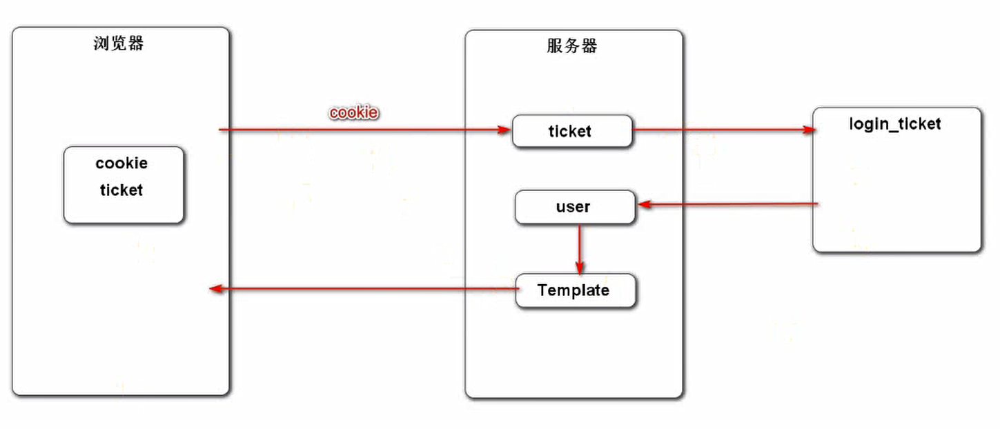

`loginTicket.getExpired().after(new Date())` 检查失效时间是否晚于当前时间

> **IntelliJ \**IDEA\**中\**查看\**某个\**类\**中的所有\**方法\****
>
> - **方法**一：alt + 7 （可以**查看类**的字段、属性、**方法**，是否继承等）
> - **方法**二： ctrl + F12.

`private ThreadLocal<User> users = new ThreadLocal<>();`在此线程内存数据;采取线程隔离的方式存储数据，可以避免多线程之间出现数据访问冲突。

ThreadLocal 以线程为key来存取值：

```java
public void set(T value) {
        Thread t = Thread.currentThread();
        ThreadLocalMap map = getMap(t);
        if (map != null)
            map.set(this, value);
        else
            createMap(t, value);
    }
```


### 账号设置

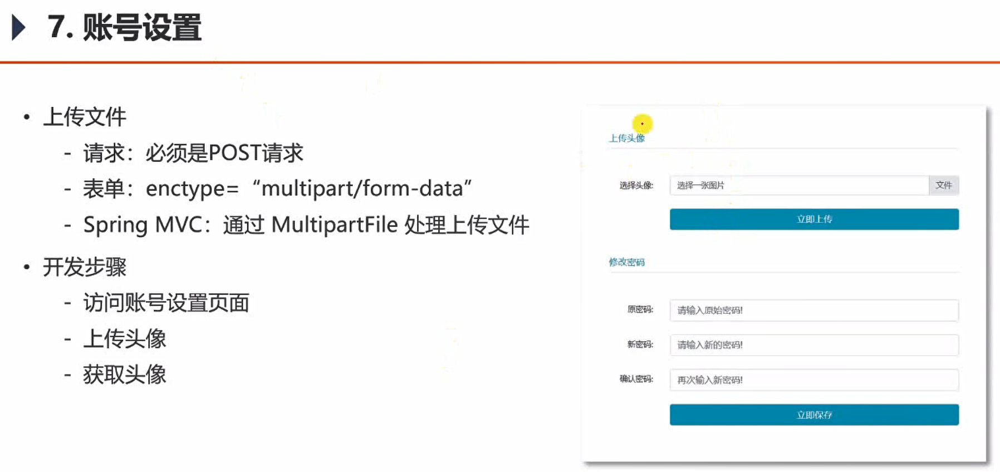


### 检查登录状态

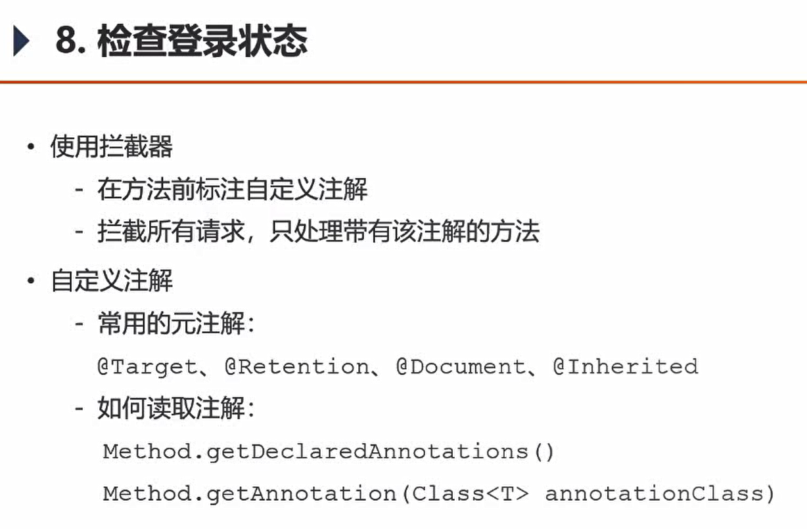

在未登录情况下，手动输入链接，仍可访问账号设置界面。存在安全隐患。

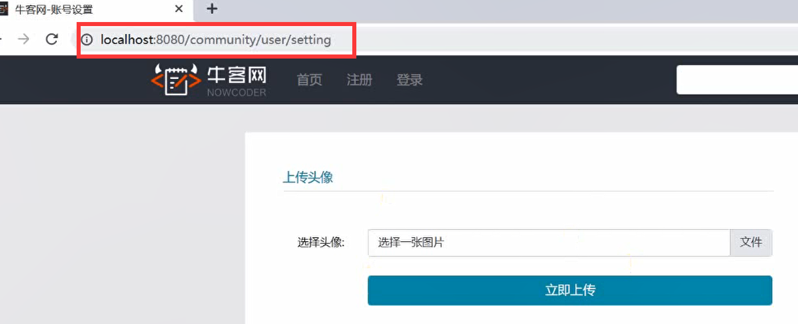

自定义注解：

```java
@Target(ElementType.METHOD) //元注解，用于指定该注解作用的目标类型， 修饰范围是方法
@Retention(RetentionPolicy.RUNTIME) //指定该注解的生效时间 保留时间
public @interface LoginRequired {

}
```

