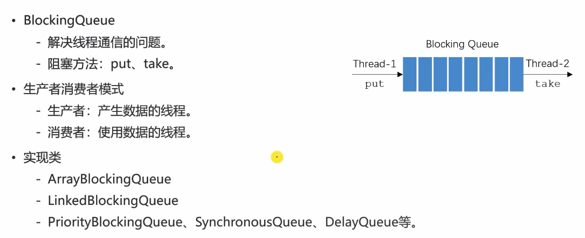
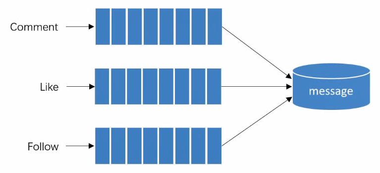
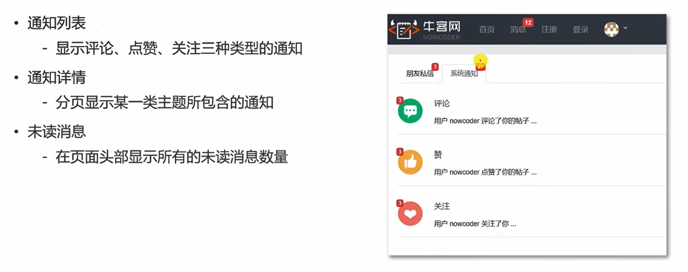

Tb级的异步消息系统。

## 一、阻塞队列



阻塞队列是 消息系统的底层实现方式。

- BlockingQueue（阻塞队列 接口）
  - 解决线程通信的问题。
  - 阻塞方法：put、take。
  - 满足了 生产者消费者模式（生产者：产生数据的线程。消费者：使用数据的线程。）避免了两个线程直接打交道。
  - 队列满了，put方法就阻塞。空了，take方法就阻塞。高效。


- 实现类
  - ArrayBlockingQueue
  - LinkedBlockingQueue
  - PriorityBlockingQueue、SynchronousQueue、DelayQueue等。
- 消息队列
  - 点对点模式
  - 发布订阅模式

实例：BlockingQueueTests.java

## 二、Kafka入门

- Kafka简介
  - Kafka是一个分布式的**流媒体平台**。（早先只是消息队列）
  - 应用：**消息系统**、**日志收集**（大批量采集、用户行为分析）、**用户行为追踪**（分析）、**流式处理**。

- Kafka特点
  - 高吞吐量（Tb级别）
  - 消息持久化（硬盘的顺序读写：高性能）
  - 高可靠性（分布式，可做集群部署）
  - 高扩展性

- Kafka术语
  - Broker（每一台服务器称做Broker）、Zookeeper（用来管理集群）
  - Topic（主题，文件夹：用来存放消息）、Partition（分区，一个主题可以被分为多个分区，增强了并发能力）、Offset（消息在分区内存放的索引）
  - Leader Replica（主副本，增强数据可靠性，冗余，可以做响应）、Follower Replica（随从副本，只是从主副本做备份，不做响应；一旦主副本挂掉了，就从从副本中找到一个做为主副本（分布式玩法））
  -  http://kafka.apache.org


**配置：**

config/zookeeper.properties

```
# the directory where the snapshot is stored.
dataDir=E:/data/work/zookeeper
```

server.properties

```
# A comma separated list of directories under which to store log files
log.dirs=E:/data/work/kafka-logs
```

命令文档：kafka.apache.org/documentation/


**使用：**

1. 先启动zookeeper

``` E:\data\work\kafka_2.12-2.2.0> bin\windows\zookeeper-server-start.bat config\zookeeper.properties```


2. 启动kafka

bin\windows\kafka-server-start.bat config\server.properties


3. 创建主题

```
kafka-topics.bat --create --bootstrap-server localhost:9092 --replication-factor 1 --partitions 1 --topic test
```

--bootstrap-server：指定服务器

--replication-factor：指定副本数量

--partitions：指定分区数量

--topic：主题

查看是否创建成功：

```
kafka-topics.bat --list --bootstrap-server localhost:9092
```


向某服务器的某主题发送消息：

```
kafka-console-producer.bat --broker-list localhost:9092 --topic test
```


另起一个 消费者，接收数据：

```
kafka-console-consumer.bat --bootstrap-server localhost:9092--topic test --from-beginning
```

--from-beginning:从头开始读


## 三、Spring整合Kafka

1. 引入依赖
   
- spring-kafka
  
2. 配置Kafka
   
- 配置server、consumer
  
3. 访问Kafka

   - 生产者

   ```
   kafkaTemplate.send(topic,data);
   ```

   - 消费者

   ```
   //接收test主题的消息，接收到了就放入record，调用handleMessage
   @KafkaListener(topics={"test"})
   public void handleMessage(ConsumerRecord record){}
   ```


示例代码：

```java
package com.nowcoder.community;

@RunWith(SpringRunner.class)
@SpringBootTest
@ContextConfiguration(classes = CommunityApplication.class)
public class KafkaTests {

    @Autowired
    private KafkaProducer kafkaProducer;

    @Test
    public void testKafka() {
        kafkaProducer.sendMessage("test", "你好");
        kafkaProducer.sendMessage("test", "在吗");

        try {
            Thread.sleep(1000 * 10);
        } catch (InterruptedException e) {
            e.printStackTrace();
        }
    }

}

@Component
class KafkaProducer {

    @Autowired
    private KafkaTemplate kafkaTemplate;

    public void sendMessage(String topic, String content) {
        kafkaTemplate.send(topic, content);
    }

}

@Component
class KafkaConsumer {

    @KafkaListener(topics = {"test"})
    public void handleMessage(ConsumerRecord record) {
        System.out.println(record.value());
    }


}
```


## 四、发送系统通知

异步的方式处理系统通知。

面向时间，事件驱动编程。（评论、点赞、关注都是事件）



- 定义对象，对事件进行封装
- 触发**事件**
  - 评论后，发布通知-
  - 点赞后，发布通知-
  - 关注后，发布通知

- 处理**事件**
  - 封装事件对象
  - 开发事件的生产者-
  - 开发事件的消费者

```java
为set方法设置返回对象本身
public Event setTopic(string topic){
this. topic=topic; return this;
}

调用：e.setTopic(aa).setName(nn).setHa(cc);
```


## 五、显示系统通知



