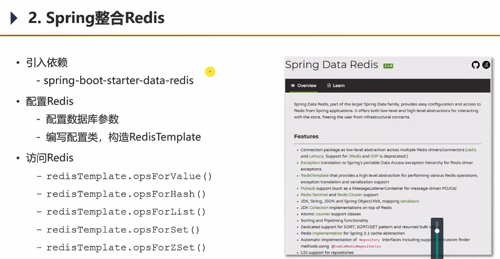
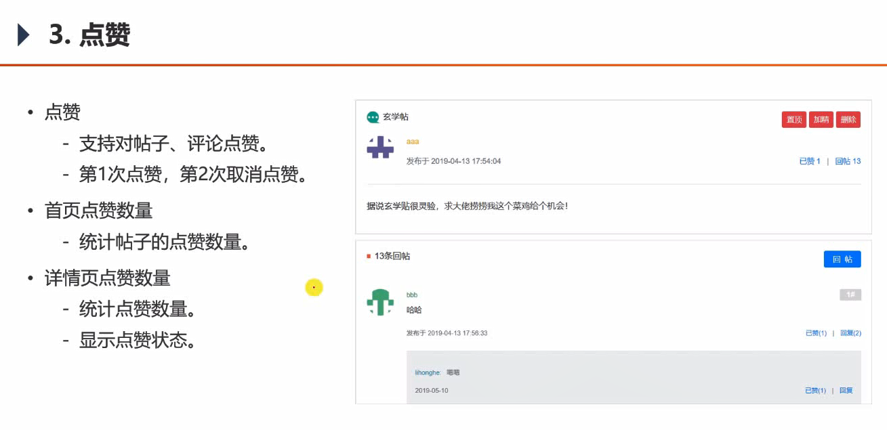
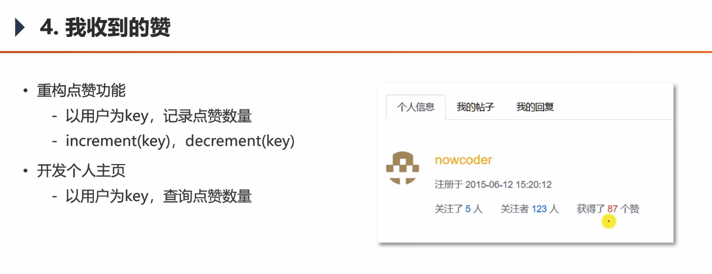
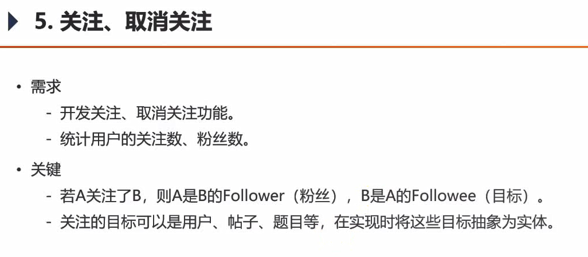
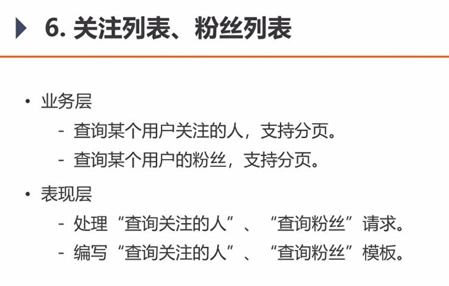
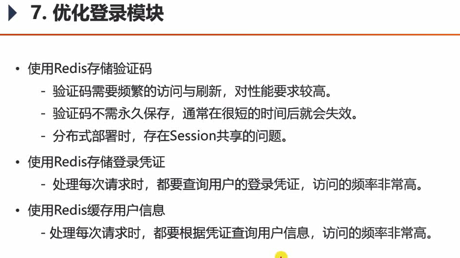
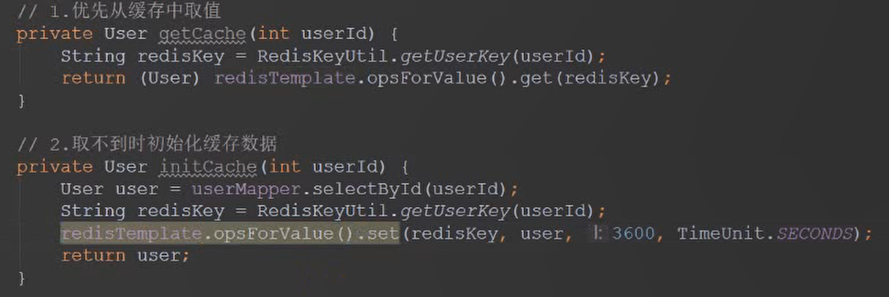

### 一.Redis入门


- Redis是一款基于**键值对**的NoSQL（关系型数据库之外的数据库的统称Not Only SQL）数据库，它的值支持多种数据结构。<key,value>
  value类型：字符串（strings）、哈希（hashes）、列表（lists）、集合（sets）、有序集合（sorted sets）等。
-  Redis将所有的数据都存放在**内存**中，所以它的读写性能十分惊人。
  同时，Redis还可以将内存中的数据以**快照或日志**的形式保存到硬盘上，以保证数据的安全性。
  - 快照： RDB(Redis DataBase) ，bin的形式；直接保存到硬盘中；但存在阻塞的情况。
  - 日志：AOF（Append only file)，每执行一个命令就存储下来；实时追加；在从硬盘向内存中恢复较慢，要重新执行。
- Redis典型的应用场景包括：**短时间内访问频繁**的情况。
  - 缓存、排行榜、
  - 计数器：帖子浏览量
  - 社交网络：点赞、关注
  - 消息队列：可满足消息队列的基本需求，但不是专业的
- 核心使用：见其官网Commands
- https://redis.io             https://github.com/microsoftarchive/redis


#### 基本命令

进入客户端：

```
redis-cli
```


内置了16个库，分别为0-15，切换方法为：(默认为0库)

```
select 1
```


清空库：

```
flushdb
```


##### String类型：

```
set test:count 1
```

*Redis提倡两个单词之间以：连接*


自增、自减：

```
incr test:count 
decr test:count
```


##### 哈希HashSet

```
hset test:user id 1
创建HashSet test:user集合，向里面添加键值对<id,1>

hset test:user username zhangsan

取值：
hget test:user id
```


##### List:

横向的容器，支持头插（左插）、尾插（右插），头取，尾取。

可以模拟：队列、栈。

```
从左侧存入
lpush test:ids 101 102 103 
内存： 103 102 101

list的长度
llen test:ids

取列表中的第二个元素
lindex test:ids 2

取list中[0-2]的元素
1range test:ids 0 2

右侧弹出一个元素
rpop test:ids
```


##### 集合：

无序、无重复元素

```
加入到集合中
sadd test:teachers aaa bbb ccc ddd eee 

查看元素个数
scard test:teachers 

随机弹出一个元素，用于抽奖
spop test:teachers 

查看集合中所有元素
smembers test:teachers 
```


##### 有序集合zset（sorted set） 

给每一个元素附加了 分数，按照分数从小到大排序（第0，第1）

```bash
创建有序集合test:students 其中aaa元素的分数为10（第0名，由小到大排序）
zadd test:students 10 aaa 20 bbb 30 ccc 40 ddd 50 eee

元素个数
zcard test:students 

查看分数
zscore test:students ccc 

查看排名
zrank test:students ccc 

分数排序为【0-2】的
zrange test:students 0 2 

分数在0-20之间的同学，同时显示score
zrangebyscore test:students 0 20 withscores
```


##### 全局命令

```
查看所有的键
keys *

查看所有以test开头的键
keys test* 

查看类型
type test:user 

判断test:user是否存在
exists test:user 

删除元素
del test:user 

此元素10s后过期，用于验证码过期之类的
expire test:students 10 
```


### 二、Spring整合Redis




1. 引入pom依赖，因为Springboot有自己的父版本已经定义好了版本号，可以不写版本号。
2. 配置数据库参数，application.propoties
3. 编写配置类，定义序列化方式
4. 可以开始使用了。


##### Redis的事务

因为不是关系型数据库，不完全满足ACID的特性。

Redis的事务：一个事务中的多个命令，会缓存在一起，一股脑发送给服务器执行。因此**在事务过程中的查询是等不到数值的**，必须在事务之外进行查询。

也正是因为此，通常使用编程式事务对Redis进行操作。尽可能缩小事务范围。


### 三、点赞



注意考虑点赞的性能问题：很多人同时给某一个帖子点赞。

因此保存在Redis中提高性能。

Redis的数据操作非常简单，因此不用写dao了。


### 四、我收到的赞



### 五、关注、取消关注



### 六、关注粉丝、粉丝列表





- Redis存储验证码
  - 解决分布式共享验证码的问题，Redis也是数据库
- 每次请求，都去查询登录凭证，每次查数据库，会对性能有影响。
- 缓存用户信息。
  - 具有缓存时效
  - 缓存中查不到，就去查数据库并且缓存下来。
  - 一旦数据库中user信息修改，那就删除该缓存。防止更新缓存又出现其他问题。




这两个方法不要有耦合！