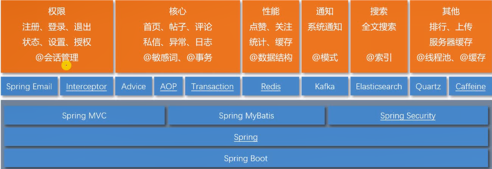
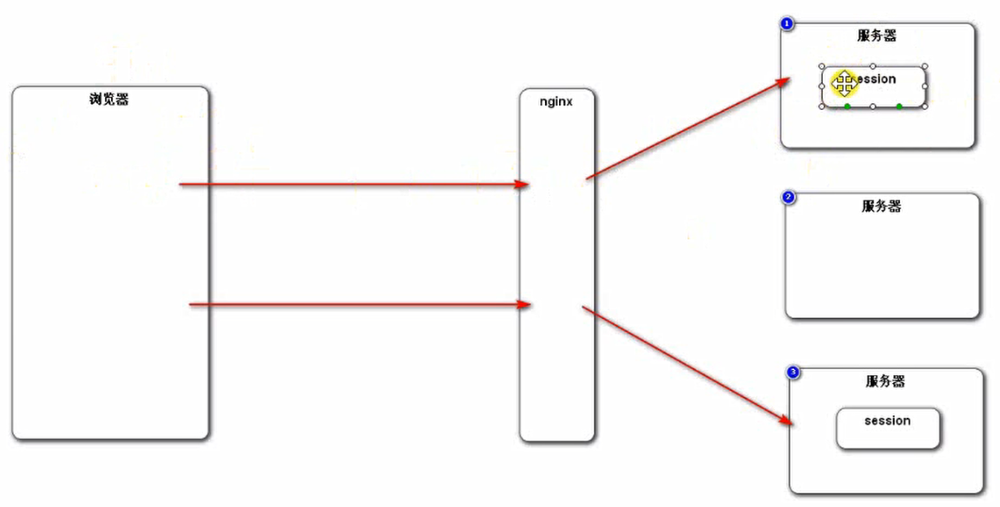
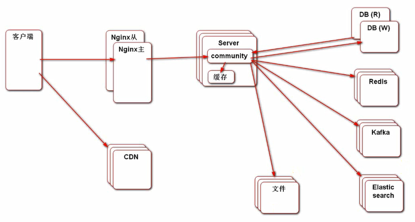
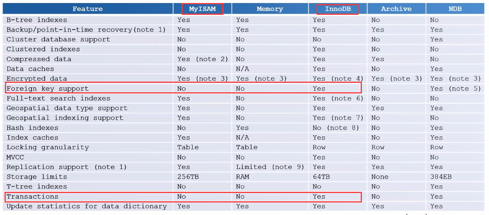
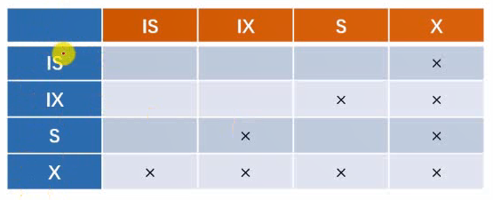
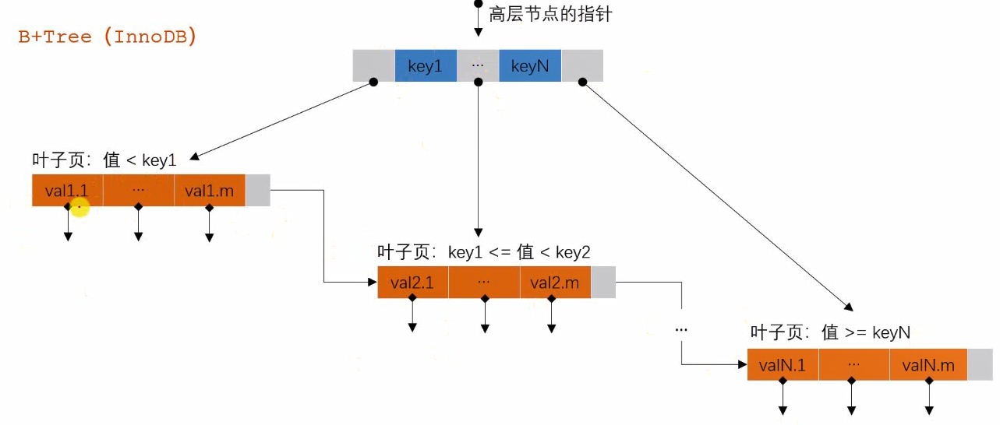

## 会话管理

### Cookie与Session的作用与区别


### 为何项目不用Session？

单体应用可用；分布式部署会出现问题；



那如何解决呢？

处理方式：

- 粘性会话：采用哈希进行分配服务器，但负载并不一定均衡
- 同步session，每个服务器内存中都存所有session数据
  - 服务器之间耦合
- 共享Session：单独一台服务器存session
  - 单体Session是瓶颈
- 主流方法：
  - 不用Session，只用cookie
  - 对应的数据存在数据库集群（Redis)当中

**ThreadLocal**   **Redis**

使用拦截器，对每次请求检查凭证（cookie），根据凭证查询到具体的用户信息，并保存在ThreadLocal中。并且在线程执行完毕后，清除ThreadLocal中的信息，防止内存泄露。

h5新增了代替cookie的方法：localStorage保存token（就是uuid）


### Intercepter

底层由AOP实现。

## 核心业务

### 敏感词过滤

  2.使用**前缀树Trie**完成敏感词过滤，禁止在发帖和评论时出现违规敏感词；  

### 事务管理

Transaction

  3.使用**Spring****事务**保证在添加评论时，评论数量也会相应增加；  

### Advice控制器的通知，统一处理异常

```
@ExceptionHandler({Exception.class})//捕获的异常类型：Exception，是所有异常的父类
```

### AOP统一记录业务层日志

使用**AOP**，在非侵入业务代码的情况下，完成统一的日志记录；

## 性能提升

点赞、关注、统计UV等、缓存

Redis的数据结构及其对应适合存储的数据


## 通知模块

Kafka背后的通用模式：生产者消费者模式

手写模式的代码


## 搜索模块

全文搜索

Elasticsearch

关注其数据索引结构


## 其他

帖子排行、上传、服务器缓存

### Quartz


### 线程池


### Caffeine

本地缓存

分布式部署时有一定局限性。


# 运维角度看项目

真实环境下到底是怎么部署的？



真是情况下的关注重点：**性能、可靠性、安全问题**。


面试：

1. 职业素养：数据结构、算法
2. 项目经验，去了直接干活
3. 钻研能力，长板。哪熟就问你哪。具有独立自主解决问题的能力。深入研究一个地方：mysql或者高并发。为长板。


# 常见重点面试题：

1. MySQL
	存储引擎、事务、锁、索引
2. Redis
    数据类型、过期策略、淘汰策略、缓存穿透、缓存击穿、缓存雪崩、分布式锁
3. Spring
    Spring IoC、Spring AOP、Spring MVC


### MySQL



事务的特性
·原子性、一致性、隔离性、持久性
事务的隔离性
·并发异常：第一类丢失更新、第二类丢失更新、脏读、不可重复读、幻读
·**隔离级别**：Read Uncommitted、Read Committed、Repeatable Read、Serializable
Spring事务管理
·声明式事务
·编程式事务

范围

- 表级锁：开销小、加锁快，发生锁冲突的概率高、并发度低，不会出现死锁。
- 行级锁：开销大、加锁慢，发生锁冲突的概率低、并发度高，会出现死锁。

类型（InnoDB）

- 共享锁（s）：行级，读取一行；
- 排他锁（x）：行级，更新一行；
- 意向共享锁（Is）：表级，准备加共享锁；
- 意向排他锁（Ix）：表级，准备加排他锁；
- 间隙锁（NK）：行级，使用范围条件时，对范围内不存在的记录加锁。一是为了防止幻读，二是为了满足恢复和复制的需要。



加锁
·增加行级锁之前，InnoDB会自动给表加意向锁；
·执行DML语句时，InnoDB会自动给数据加排他锁；
·执行DQL语句时，默认是不加锁的。需要手动显式加锁：
共享锁（s）：SELECT.FROM…WHERE…LOCK IN SHARE MODE；排他锁（x）：SELECT.FROM..WHERE.FOR UPDATE；间隙锁（NK）：上述sQL采用范围条件时，InnoDB对不存在的记录自动增加间隙锁。

死锁
·场景
事务1：UPDATE T SET…WHERE ID=1；UPDATE T SET.WHERE ID=2；事务2：UPDATE T SET.WHERE ID=2；UPDATE T SET.WHERE ID=1；
·解决方案
1.一般InnoDB会自动检测到，并使一个事务回滚，另一个事务继续；
2.设置超时等待参数 innodb lock wait timeout；
·避免死锁
1.不同的业务并发访问多个表时，应约定以相同的顺序来访问这些表；
2.以批量的方式处理数据时，应事先对数据排序，保证线程按固定的顺序来处理数据；
3.在事务中，如果要更新记录，应直接申请足够级别的锁，即排他锁；

悲观锁（数据库）

乐观锁（自定义）
1.版本号机制
UPDATE..SET.，VERSION=#{version+1}WHERE.…AND VERSION=${version}
2.CAs算法（Compare and swap）
是一种无锁的算法，该算法涉及3个操作数（内存值v、旧值A、新值B），当v等于A时，采用原子方式用B的值更新v的值。该算法通常采用自旋操作，也叫自旋锁。它的缺点是：
·ABA问题：某线程将A该为B，再改回A，则cAs会误认为A没被修改过。·自旋操作采用循环的方式实现，若加锁时间长，则会给CPU带来巨大的开销。
·CAS只能保证一个共享变量的原子操作。


### 索引

B+Tree（InnoDB）

- 数据分块存储，每一块称为一页；
- 所有的值都是按顺序存储的，并且每一个叶子到根的距离相同；
- 非叶节点存储数据的边界，叶子节点存储指向数据行的指针；
- 通过边界缩小数据的范围，从而避免全表扫描，加快了查找的速度。



